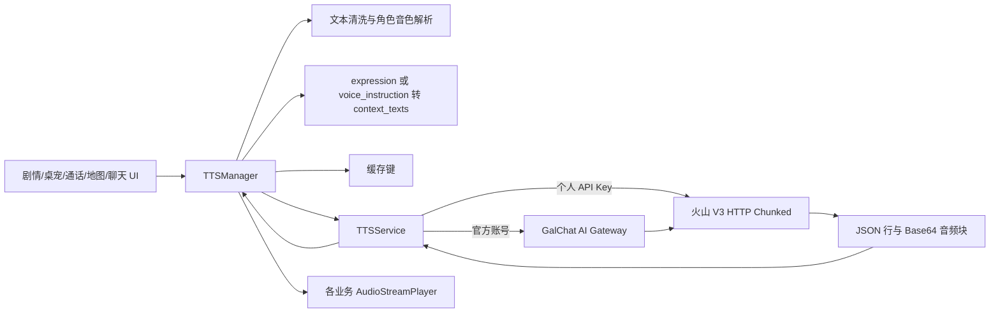

# 豆包语音合成模型 2.0 实现审计

> 审计日期：2026-07-24  
> 审计范围：Godot 客户端、官方 AI Gateway、剧情编辑器及主要 TTS 业务入口  
> 结论性质：基于审计日期可访问的火山引擎官方文档与当前仓库静态实现；未使用生产 API Key 发起计费请求

## 实施状态（2026-07-24）

本报告完成后，第一轮优化已经落地：

- HTTP Chunked 模式仅开放 MP3，历史 WAV 配置自动迁移为 MP3；
- 客户端与官方网关统一校验官方采样率枚举、语速、音量和 MP3 比特率；
- 客户端提取结束帧 `usage` 并放入 TTS 完成结果；
- 语音与视频通话在单次通话内复用 `section_id`，直连和官方网关均已透传；
- 固定来电兼容对象台词，可配置 `expression` 和 `voice_instruction`，旧字符串数据继续可用；
- 固定来电编辑器增加逐句表情与语音指令输入，并保留未知扩展字段；
- 网关 TTS 聚焦测试已覆盖合法请求、`section_id`、非法采样率和 WAV 拒绝。

尚未实施的后续项包括真正的边收边播、字幕事件消费、上游 usage 持久化统计，以及核心角色默认音色差异化。

## 1. 结论摘要

当前项目接入豆包语音合成模型 2.0 的**核心协议是正确的**：

- 使用 `https://openspeech.bytedance.com/api/v3/tts/unidirectional`；
- 使用新版控制台的 `X-Api-Key` 鉴权；
- 使用 `X-Api-Resource-Id: seed-tts-2.0`；
- 将自然语言语音指令放在 `req_params.additions.context_texts` 中，并把 `additions` 序列化为 JSON 字符串；
- 默认音色 `zh_female_vv_uranus_bigtts` 是官方列出的 Vivi 2.0 音色，支持“指令遵循”；
- 正确拼接 HTTP Chunked 返回中 `code = 0` 的 Base64 音频数据；
- 剧情对话与桌宠主链路已经能把 `voice_instruction` 转为 `context_texts`。

因此，项目并不存在“把 TTS 1.0 的 `emotion` 参数误当作 TTS 2.0 指令”或“指令字段放错层级”这类根本性错误。

但实现仍有以下重要问题：

1. **WAV 与当前 HTTP Chunked 拼接方式不安全。** 官方明确说明流式场景传 `wav` 会多次返回 WAV header，推荐使用 `pcm`。项目直接拼接所有 Base64 块并按单个 WAV 解码，可能只播放首段、截断或解码失败。
2. **客户端缺少官方参数范围和枚举校验。** `sample_rate`、`speech_rate`、`loudness_rate`、`bit_rate` 可在本地形成官方不接受的请求；官方网关对采样率也只校验连续区间，而不是官方离散集合。
3. **多轮会话能力没有使用。** 官方提供 `additions.section_id`，特别建议一通电话内复用同一 UUID。当前固定来电、AI 语音通话和视频通话均未传递该字段，连续台词的语气衔接和上下文稳定性没有充分利用。
4. **情绪指令覆盖不完整。** 剧情对话、日期事件和桌宠链路较完整，但固定语音来电的数据结构仅保存字符串台词；语音/视频通话播放层也不解析或传递语音指令。
5. **“流式接口”目前被当作整包接口使用。** Godot `HTTPRequest` 和官方 Gateway 都会等完整响应后再解析、播放，无法获得首包低延迟和边收边播收益。
6. **请求了 usage 和可选字幕，但没有完整消费。** 项目发送 `X-Control-Require-Usage-Tokens-Return: *`，却未把结束帧中的 `usage.text_words` 写入结果；字幕事件也未进入返回模型。
7. **角色默认音色没有差异。** 所有默认角色都使用 Vivi 2.0。项目支持逐角色配置，但默认配置无法体现角色身份差异。

综合评级：**协议接入合格，情绪指令主链路可用；参数防御、连续会话、固定通话覆盖和流式播放仍需补齐。**

## 2. 官方文档基线

### 2.1 本次核对的官方资料

1. [HTTP Chunked/SSE 单向流式 V3](https://docs.volcengine.com/docs/6561/1598757)
   - 页面标注最近更新时间：2026-05-25；
   - 定义 endpoint、鉴权头、请求体、音频参数、`context_texts`、`section_id` 和响应帧。
2. [豆包语音音色列表](https://docs.volcengine.com/docs/6561/1257544)
   - 页面标注最近更新时间：2026-07-20；
   - 明确区分 TTS 2.0 Uranus 音色、ICL Uranus 2.0 音色和 TTS 1.0 Moon/Mars 音色；
   - `zh_female_vv_uranus_bigtts` 对应 Vivi 2.0，支持指令遵循。
3. [豆包语音产品动态](https://docs.volcengine.com/docs/6561/1598756)
   - 记录 TTS 2.0 于 2025-09 上线，定位为 Query-Response 对话式合成；
   - 用于交叉确认版本发布时间和音色演进。

官方文档站将 V3 页面归在“历史语音合成接口”目录下，但该页面仍在持续更新，且当前仓库使用的 endpoint、请求字段和资源 ID 均与该页一致。上线前仍应在火山控制台确认账户实际开通的产品与音色授权。

### 2.2 TTS 2.0 指令控制的正确方式

官方把 TTS 2.0 的自然语言控制定义为：

```json
{
  "req_params": {
    "text": "你今天回来得有点晚。",
    "speaker": "zh_female_vv_uranus_bigtts",
    "audio_params": {
      "format": "mp3",
      "sample_rate": 24000
    },
    "additions": "{\"context_texts\":[\"你可以用有些担心但克制的语气说话吗？\"]}"
  }
}
```

关键点如下：

- `additions` 在外层请求中是 **JSON string**，不是对象；
- `context_texts` 是该字符串反序列化后的数组字段；
- 指令可描述语速、情绪、语气、音量和音感；
- TTS 2.0 应优先使用自然语言指令，不应直接套用 TTS 1.0 多情感音色的 `audio_params.emotion` 枚举；
- `section_id` 可把串行请求关联成同一多轮会话，官方示例特别提到“一通电话”使用同一 UUID。

### 2.3 官方参数约束

| 参数 | 官方约束 | 项目默认值 |
|---|---|---:|
| `resource_id` | TTS 2.0 使用 `seed-tts-2.0` | `seed-tts-2.0` |
| `format` | 文档列出 `mp3`、`ogg_opus`、`pcm`；流式 `wav` 会重复 header | `mp3`，UI 允许 `wav` |
| `sample_rate` | `8000/16000/22050/24000/32000/44100/48000` | `24000` |
| `speech_rate` | `[-50, 100]` | `0` |
| `loudness_rate` | `[-50, 100]` | `0` |
| MP3 `bit_rate` | 默认有效范围通常为 `64000` 至 `160000`；低于 64k 需额外开关 | `96000` |
| `emotion_scale` | 配合旧式 `emotion`，范围 `1` 至 `5` | 未使用，符合 TTS 2.0 指令方案 |

## 3. 当前项目调用链



核心文件：

- 客户端协议层：[scripts/api/tts_service.gd](../scripts/api/tts_service.gd)
- 客户端兼容与指令层：[scripts/api/tts/tts_manager.gd](../scripts/api/tts/tts_manager.gd)
- 官方服务转发层：[backend/ai_gateway/app.py](../backend/ai_gateway/app.py)
- TTS 配置：[scripts/data/config_resource.gd](../scripts/data/config_resource.gd)
- 剧情对话入口：[scripts/dialogue/dialogue_manager.gd](../scripts/dialogue/dialogue_manager.gd)
- 固定语音来电入口：[scripts/ui/mobile/chat/voice_call_panel.gd](../scripts/ui/mobile/chat/voice_call_panel.gd)
- 编辑器校验与测试：[addons/story_editor/core/story_validator.gd](../addons/story_editor/core/story_validator.gd)、[addons/story_editor/tests/tts_2_emotion_smoke.gd](../addons/story_editor/tests/tts_2_emotion_smoke.gd)

## 4. 已正确实现的部分

### 4.1 请求 endpoint 与鉴权

直连路径使用官方 V3 HTTP Chunked endpoint，并发送：

- `Content-Type: application/json`；
- `X-Api-Key`；
- `X-Api-Resource-Id: seed-tts-2.0`；
- `X-Api-Request-Id`；
- `X-Control-Require-Usage-Tokens-Return: *`。

这与新版控制台的推荐鉴权方式一致。官方网关也采用同样的上游请求头。

### 4.2 `context_texts` 层级与序列化

客户端 `_build_request_body()` 将 `context_texts` 合并到 `additions`，随后执行 `JSON.stringify(additions)`。官方网关使用 `json.dumps()` 完成同样操作。两条路径一致，现有 smoke test 也覆盖了这一点。

这是本次审计最关键的确认项：**当前语音指令并没有放错字段。**

### 4.3 音色版本拦截

项目会拒绝常见旧版音色：

- `*_moon_bigtts`；
- `*_mars_bigtts`；
- `*_emo_v2_*`；
- 旧 `ICL_*_tob`；
- `BV001_streaming`。

同时放行 `*_uranus_bigtts` 和 `ICL_uranus_*_tob`。这一判断与官方当前 TTS 2.0 音色命名基本一致，并有 smoke test 覆盖。

### 4.4 指令生成策略

项目把内部 expression 映射为自然语言，例如“略带担心但克制”，而不是发送固定 emotion 枚举。自定义 `voice_instruction` 优先于 expression，并自动追加“保持原本声线、音高和人物年龄感”。

这一策略符合官方“可探索的自然语言指令”定位，也适合角色陪伴产品。限制强度、避免改变身份与声线，有助于降低偶发的音色漂移。

### 4.5 缓存键

兼容缓存键已包含文本、speaker、资源 ID、格式、采样率、语速、音量、model、SSML、`context_texts` 和 `additions`。相同文本使用不同情绪指令时不会误命中同一缓存，这是正确的。

### 4.6 响应与诊断

项目能够：

- 逐行解析返回 JSON；
- 拼接 `code = 0` 的 Base64 音频块；
- 忽略没有音频的结束帧；
- 校验 MP3/WAV 基本文件头；
- 读取并在错误中附带 `X-Tt-Logid`；
- 映射网络错误和常见 HTTP 状态。

## 5. 问题与遗漏

### P1：WAV 在当前流式拼接方案下可能生成无效音频

**证据**

- UI 明确允许 `mp3` 和 `wav`；
- V3 文档明确指出，流式场景传 `wav` 会多次返回 WAV header，建议使用 `pcm`；
- 当前实现将每个 Base64 块原样拼接，然后只检查整体开头是否为 `RIFF...WAVE`。

**影响**

多个独立 WAV 块直接拼接不等于一个合法 WAV 文件。文件头校验可能通过，但 Godot 解码器可能只读取第一块、忽略后续块或直接失败。长台词更容易暴露该问题。

**建议**

短期只向用户开放 MP3，并把已有 `wav` 配置迁移为 `mp3`。如果必须使用无损音频，应请求 `pcm`，再由客户端根据采样率、位深和声道信息构造单个 `AudioStreamWAV`；不要直接拼接多个 WAV 文件。

### P1：客户端参数校验不足，网关采样率校验与官方不一致

**证据**

客户端 `_validate_request_options()` 只检查 API Key、speaker 和格式，没有校验数值范围。官方网关把 `sample_rate` 定义为 `8000 <= value <= 48000`，因此 `11025`、`12000` 等非官方枚举也能通过。

**影响**

错误配置会在请求到达火山引擎后才失败，用户只能看到笼统参数错误；个人直连与官方网关模式还可能表现不一致。

**建议**

- 客户端和网关统一使用采样率集合校验；
- 将 `speech_rate`、`loudness_rate` 限制在 `[-50, 100]`；
- 默认 MP3 bit rate 限制为 `[64000, 160000]`；
- 如要开放更低 bit rate，显式加入官方要求的 `disable_default_bit_rate`；
- 对设置文件中的旧值做加载时归一化，而不只是请求时报错。

### P1：通话没有使用 `section_id`，连续语音缺少服务端多轮上下文

**证据**

官方定义 `additions.section_id` 用于同一上下文的串行合成，并直接以“一通电话”为推荐场景。客户端、网关请求模型和缓存键均没有该字段。

**影响**

固定来电由多句连续台词组成，AI 语音通话也天然是连续会话。每句完全独立合成时，相邻句的节奏、情绪延续和对话感可能不稳定。

**建议**

- 通话建立时生成 UUID；
- 同一通话内所有角色 TTS 请求复用该 `section_id`；
- 挂断或切换角色时废弃；
- 严格串行发送同一 section 的请求；
- `section_id` 不应直接进入跨会话永久缓存，否则缓存结果会掩盖上下文效果。可在通话模式禁用客户端缓存，或把“是否使用上下文”纳入缓存策略。

### P1：固定语音来电丢失逐句语音指令

**证据**

固定来电当前 `lines` 是字符串数组，编辑器也按字符串编辑。`voice_call_panel.gd` 清洗台词后只构造 speaker，不调用 `build_tts_2_instruction_options()`。相比之下，剧情事件已经支持独立 `voice_instruction` 字段。

**影响**

固定来电是最需要连续语气设计的场景之一，却只能依赖模型从文本自行推断情绪，无法由编剧稳定指定“压低声音”“停顿后释然”“略带慌张”等演出要求。

**建议**

将固定来电台词兼容升级为：

```json
{
  "text": "你终于接电话了。",
  "expression": "worried",
  "voice_instruction": "先松一口气，再略带埋怨地说"
}
```

运行时同时兼容旧字符串和新对象；编辑器增加对应字段和 80 字校验；迁移不必一次性改写旧数据。

### P2：当前并未获得 HTTP Chunked 的实时播放收益

**证据**

Godot `HTTPRequest.request_completed` 在完整请求结束后才进入解析。官方网关使用 `httpx.post()` 获取完整 `response.content` 后再返回普通 `Response`。两层都会缓存完整响应。

**影响**

虽然调用的是“单向流式”接口，但用户必须等待整句合成与下载完成才开始播放。长句、移动网络和官方网关模式下首音延迟会明显增加，网关也承担整包内存占用。

**建议**

- 如果现阶段台词都很短，可明确将该接口作为“整句合成”使用，不必立即重构；
- 若通话体验要求低延迟，网关改为 `httpx.stream()` + `StreamingResponse`；
- Godot 端需采用能逐块读取 HTTP 响应的实现，并选择 MP3/PCM 的增量播放策略；
- 更高实时性需求可评估官方 WebSocket 双向流式接口，但这是架构升级，不应与本次参数修复混做。

### P2：usage 请求了但没有进入可观测性体系

**证据**

两条上游路径都请求 `X-Control-Require-Usage-Tokens-Return: *`。官方会在 `code = 20000000` 的结束帧返回 `usage.text_words`，当前解析器只提取音频块，没有保存 usage。官方网关按 `len(payload.text)` 预估额度，也没有用上游实际 usage 校准。

**影响**

无法准确对账计费字符、评估缓存收益、发现文本归一化与上游计费差异。

**建议**

解析结束帧并把 `usage` 放入 `tts_completed` 结果；官方网关记录实际 `text_words`，并区分“本地配额单位”与“上游计费字符”。

### P2：`enable_subtitle` 只有请求，没有完整返回能力

**证据**

请求模型支持 `enable_subtitle`，但解析器忽略 `sentence`/字幕事件，结果中也没有字幕或时间戳字段。

**影响**

调用方即使设置为 true，也拿不到可用于口型、逐字高亮或精确字幕的数据；同时会产生额外上游处理而无产品收益。

**建议**

在完成字幕事件解析之前，不对业务层开放此选项；需要口型同步时再建立独立的字幕结果结构和事件信号。

### P2：情绪表达映射覆盖面不一致

**现状**

| 入口 | speaker | expression 映射 | 自定义 `voice_instruction` | `section_id` |
|---|---|---|---|---|
| 剧情对话 | 支持 | 支持 | 支持 | 不支持 |
| 日期剧情 | 支持 | 支持 | 支持 | 不支持 |
| 桌宠 | 支持 | 部分依赖生成格式 | 支持 | 不支持 |
| 固定语音来电 | 支持 | 不支持 | 不支持 | 不支持 |
| AI 语音/视频通话 | 支持 | 未见稳定透传 | 未见稳定透传 | 不支持 |
| 公共聊天/地图气泡 | 支持 | 各自构造，未统一 | 各自构造，未统一 | 不支持 |
| 设置页试听 | 支持 | 不支持 | 不支持 | 不适用 |

**建议**

建立统一的 `TtsUtteranceOptions` 约定：`character_id`、`speaker`、`expression`、`voice_instruction`、`conversation_id`、`request_source`。业务层只提供语义数据，由 `TTSManager` 统一转换为协议字段，减少入口间漂移。

### P2：所有角色默认使用同一 Vivi 2.0 音色

**证据**

`DEFAULT_TTS_CHARACTER_SPEAKERS` 中所有角色都配置为 `zh_female_vv_uranus_bigtts`。

**影响**

虽然逐角色 speaker 配置机制存在，但新安装或未配置用户听到的所有角色声线相同。自然语言指令只能调整说法，不能替代角色音色设计。

**建议**

为核心角色建立经授权和人工试听确认的 TTS 2.0 speaker 清单，并记录语言、角色年龄感、音色授权状态和回退音色。不要仅根据 speaker 名称自动分配。

### P3：指令长度限制存在三套口径

**现状**

- AI prompt 要求最多 40 个汉字；
- 剧情编辑器与运行时截断到 80 个字符；
- TTSService/官方网关允许每条 `context_texts` 最多 120 个字符，最多 2 条。

**影响**

同一指令在生成、编辑、运行和官方网关路径中的行为不一致，错误提示也难以解释。

**建议**

定义一个项目级常量。若产品目标是简短可控，建议业务字段限制 80 个 Unicode 字符，并在所有层一致校验；底层 120 只作为防御上限，不作为编辑器承诺。

### P3：请求 ID 不是标准 UUID

当前 `X-Api-Request-Id` 由时间戳和随机整数组成。官方把它描述为 UUID 随机字符串，且字段可选。当前值大概率可工作，但建议改用标准 UUID，方便跨客户端、网关和火山日志统一追踪，并避免随机整数碰撞。

### P3：音色合法性仍是命名启发式判断

当前只根据后缀判断版本，不能确认音色是否真实存在、是否已授权、是否支持指令遵循或对应语种。尤其 `S_*` 声音复刻 ID 与公版 TTS 2.0 speaker 的资源和模型规则不完全相同，不应仅凭前缀统一放行。

建议维护经验证的公版音色目录；自定义复刻音色单独标记类型、资源 ID 和模型配置，并通过一次真实试听验证授权。

## 6. 指令设计评估

### 6.1 当前策略的优点

- 使用自然语言，符合 TTS 2.0 的 Query-Response 设计；
- 指令短，通常只描述一个主要情绪和一个强度约束；
- “克制”“不过分夸张”等限制适合日常陪伴对话；
- 明确要求保持声线，降低角色身份漂移；
- 自定义指令优先，expression 可作为保底。

### 6.2 可改进点

1. **避免每句都重复过长的身份保护。** 当前几乎每个映射都重复“保持原本声线、音高和人物年龄感”，会增加指令长度，也可能稀释主要演出意图。应通过 A/B 试听判断简化为“保持角色原声”是否更稳定。
2. **建立可试听的基准句。** 仅靠代码 smoke test 只能证明字段存在，不能证明情绪真的生效。每个核心 expression 应有固定文本、固定音色、无指令对照和有指令样本。
3. **区分强度与类别。** `worried`、`panic`、`afraid` 等相近类别应使用统一强度词，减少映射之间不可预测的跨度。
4. **不要把年龄、性别、身份变化作为合法指令。** 当前 AI prompt 已明确禁止，方向正确。
5. **对超短文本谨慎。** “嗯”“好吧”等极短文本对自然语言指令的响应可能波动，应允许业务使用更明确标点或合并上下文，但不能把舞台说明直接送入朗读文本。

建议建立如下人工听感评分：

| 维度 | 评分范围 | 判定目标 |
|---|---:|---|
| 情绪命中 | 1-5 | 是否听出目标情绪 |
| 角色一致性 | 1-5 | 声线、年龄感是否稳定 |
| 自然度 | 1-5 | 是否像自然对话而非配音腔 |
| 强度合适 | 1-5 | 是否过度、过弱 |
| 文本准确 | 通过/失败 | 是否漏字、错读、读出标签 |

## 7. 推荐修复顺序

### 阶段 A：正确性与防御性

1. 暂时移除 WAV 选项或自动迁移为 MP3。
2. 客户端与网关统一参数枚举和范围校验。
3. 统一指令长度常量与错误提示。
4. 为结束帧、错误帧、usage、重复 WAV header 增加纯解析测试。

验收标准：所有非法参数在本地被明确拒绝；MP3 长文本不会截断；两种服务模式生成完全一致的上游请求。

### 阶段 B：通话与情绪覆盖

1. 固定来电 `lines` 兼容对象结构。
2. 语音/视频通话完整透传 expression 和 `voice_instruction`。
3. 引入通话级 `section_id`，客户端与网关均透传。
4. 为核心角色配置不同 TTS 2.0 音色并做授权检查。

验收标准：编辑器可为每句来电指定指令；同一通话使用同一 section；挂断后 section 更换；旧字符串数据仍可播放。

### 阶段 C：延迟与可观测性

1. 记录 `usage.text_words`、logid、首包时间、总耗时、音频时长和缓存命中。
2. 根据真实 P95 延迟决定是否实施增量播放。
3. 如实施流式播放，优先 MP3 或 PCM，不使用多 header WAV 拼接。
4. 只有存在逐字高亮或口型需求时才实现字幕事件。

验收标准：能区分排队、上游首包、下载、解码和播放启动耗时；可用 logid 定位失败请求。

## 8. 建议测试矩阵

### 8.1 非计费单元与 smoke test

- `context_texts` 被序列化为 `additions` JSON string；
- `section_id` 位于 `additions`，不位于 `audio_params`；
- MP3 才发送 `bit_rate`；
- 非法采样率 `11025` 被拒绝；
- 语速 `-51/101` 和音量 `-51/101` 被拒绝；
- TTS 1.0 Moon/Mars speaker 被拒绝；
- Uranus 与 ICL Uranus speaker 被允许；
- 不同指令产生不同缓存键；
- 结束帧 usage 被提取；
- 固定来电旧字符串和新对象均可解析。

### 8.2 受控计费集成测试

使用专用测试 Key、固定短文本和低频执行：

1. 无指令基线；
2. “慢一点说”；
3. “略带开心但不过分夸张”；
4. “压低音量，像怕打扰别人”；
5. 同一 `section_id` 的三句连续对话；
6. 不同 `section_id` 的相同三句对照；
7. 个人直连与官方网关输出可播放性对照；
8. 旧音色、无授权音色和超限参数错误信息对照。

音频结果应由人工盲听，不应只以 HTTP 200 作为“情绪功能正常”的证据。

## 9. 最终判断

### 是否存在错误？

存在，但不是语音指令字段或 TTS 2.0 版本选择错误。最明确的实现错误是：

- 在 HTTP Chunked 场景开放 WAV，却按单一 WAV 文件拼接和解码；
- 参数校验没有严格遵循官方离散值和范围；
- `enable_subtitle` 与 usage 只请求不消费，形成不完整契约。

### 是否存在遗漏？

存在，主要是：

- 未使用通话级 `section_id`；
- 固定语音来电和部分聊天入口未透传逐句语音指令；
- 没有真正边收边播；
- 缺少音频效果的人工基准与计费 usage 可观测性；
- 默认角色音色没有差异化。

### 当前能否继续使用？

可以。以默认 MP3、24000 Hz、Vivi 2.0 和短句为主时，当前核心路径具备正确的 TTS 2.0 指令能力。建议在扩大语音通话和固定来电内容生产前，优先完成阶段 A 与阶段 B；否则问题更可能表现为“偶发没情绪、长句音频异常、连续台词不连贯”，而不是每次都报明确错误。