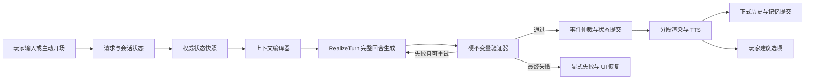
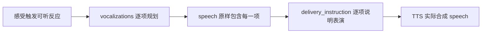
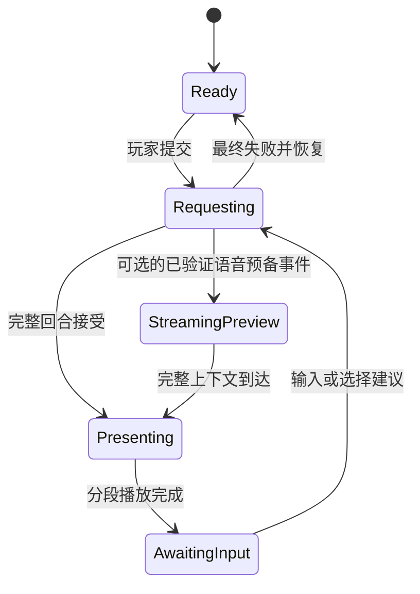

# 可复刻 AI 角色对话系统策划与开发规格

> 文档状态：生产架构基线  
> 参考实现合同：`RealizeTurn v6`  
> 适用范围：角色陪伴、互动叙事、RPG 对话、带动作与动态语音的生成式角色系统

## 1. 文档目的

本文给出一套可在其他项目中独立复刻的 AI 角色对话系统。它不是某个模型、引擎或角色的提示词副本，而是一套从状态、上下文、生成合同、验证、事件提交、展示、语音到记忆的完整工程协议。

复刻后的系统应满足以下体验目标：

- 角色回应玩家刚刚表达的具体问题、行动、情绪、选择与诉求。
- 角色拥有自己的判断、边界与行动，不只是复述或顺从玩家。
- 每轮至少在信息、关系、现场、目标或下一步行动机会中产生真实变化。
- 身体感受、心理感受和可听反应由当前事件自然触发，并在玩家实际看到或听到的结果中兑现。
- 动作、对白、状态变化和 TTS 表演来自同一回合语义，不由多个系统互相改写。
- 模型输出失败时不伪造角色回复、不伪造记忆、不替玩家生成已选行为。

## 2. 核心原则

### 2.1 唯一生成所有权

普通角色回复只能由一个完整回合生成器拥有。其他模块可以提供事实、状态和约束，但不能在生成后追加台词、替换动作、随机插入拟声或用模板补写失败内容。

唯一所有权解决四类常见问题：

- 动作与台词描述不同一件事。
- 语音指令表达了正文不存在的情绪或声音。
- 记忆记录了玩家从未看到的内容。
- 新旧生成器在不同失败路径中交替接管。

### 2.2 事实与创作分层

系统必须区分两类数据：

- **权威事实**：角色设定、关系阶段、现场状态、已提交事件、玩家原文、已接受历史、可靠记忆。
- **本轮创作**：角色如何感受、回应和行动，以及如何把这些内容组织成可展示、可朗读的节拍。

模型可以创作表达，不能覆盖权威事实。程序可以验证和提交事实，不能假装角色创作台词。

### 2.3 硬不变量与文学质量分离

硬验证器只检查机器能够可靠判断的条件，例如 JSON、字段类型、数量、ID 对齐、动作归属、拟声是否真实进入 speech。它不应使用关键词规则判断“够不够深情”“是否自然”“是否挑逗”。

文学质量应通过提示词、离线评分、人工评审和真实回归样本改进。不要把某次不满意的句子变成永久关键词禁令。

### 2.4 整轮重生，不做局部修补

候选回合违反硬不变量时，将错误码反馈给同一个完整回合生成器，让它重新创作整个回合。禁止程序修改局部文本后继续提交，因为局部修补会破坏动作、对白、声音和事件之间的因果一致性。

### 2.5 提交后才产生副作用

模型候选在通过验证前，不得写入：

- 正式 AI 对话历史
- 长期记忆
- 权威场景状态
- 关系事件
- 玩家建议选项的前提事实

网络成功不等于业务成功，JSON 可解析也不等于回合可提交。

### 2.6 失败必须诚实

最终失败时，UI 恢复可操作状态并保留玩家输入或提供重试。系统可以显示技术性状态提示，但不能生成一条本地角色台词假装请求成功。

## 3. 系统边界

### 3.1 总体架构



### 3.2 模块职责

| 模块 | 唯一职责 | 不得负责 |
| --- | --- | --- |
| Session Controller | 请求 ID、忙闲状态、重试/结束/重生成 | 拼提示词、编造回复 |
| State Runtime | 权威现场快照与修订号 | 写对白、猜测未发生事件 |
| Memory Service | 召回已提交事实、候选提取与提交 | 直接改写回复 |
| Persona Resolver | 人格、知识边界、关系阶段的紧凑状态 | 输出固定台词模板 |
| Context Compiler | 按固定顺序组装只读上下文块 | 创作本轮答案 |
| RealizeTurn Generator | 一次生成完整语义计划与表现结果 | 提交状态或记忆 |
| Validator | 检查可判定硬不变量 | 按文学偏好改写文本 |
| Event Arbiter | 将合法持续效果转换为状态补丁 | 接受角色无权完成的玩家行为 |
| Renderer | 添加显示格式、按节拍播放 | 改写 speech 语义 |
| TTS Adapter | 一段 speech 对应一条动态表演指令 | 再次规划角色情绪 |
| Option Service | 基于已接受回合生成可选玩家回应 | 自动替玩家提交选择 |

## 4. 一轮对话的生命周期

### 4.1 请求前

1. 校验会话处于可提交状态。
2. 为玩家输入分配递增 `request_id`。
3. 将玩家原文加入可见历史和短期工作上下文。
4. 创建记忆提取候选任务，但不提交长期记忆。
5. 锁定输入控件并显示真实的处理中状态。

主动开场没有玩家原文。系统必须显式设置 `opening_turn=true`，不能伪造一句玩家台词作为因果证据。

### 4.2 生成前

1. 恢复或读取权威场景状态。
2. 召回与当前角色、玩家、场景和主题有关的已提交记忆。
3. 解析人格、知识边界和关系阶段。
4. 编译规范化上下文块。
5. 使用一次模型调用生成完整回合。

### 4.3 候选验收

1. 解析 JSON。
2. 验证根合同和所有字段。
3. 验证语义节拍与表现分段一一对应。
4. 验证玩家行动权、角色动作权和持续事件结构。
5. 验证每个计划拟声都真实出现在 speech 和 delivery instruction 中。
6. 失败时携带稳定错误码整轮重生。

### 4.4 接受后

1. 仲裁持续事件并提交权威场景状态。
2. 生成分段显示内容。
3. 每段 speech 与该段动态 TTS 指令一一绑定。
4. 播放或展示完整回合。
5. 将已接受 AI 回合写入历史和记忆。
6. 结算该玩家回合的记忆候选。
7. 异步生成玩家建议回应；玩家仍可自由输入。

## 5. 规范上下文合同

### 5.1 固定块顺序

推荐保持以下顺序，并让当前玩家输入始终位于最后：

1. `character_core`
2. `voice_performance`
3. `session_premise`
4. `scene_state`
5. `relevant_memories`
6. `conversation_summary`
7. `recent_turns`
8. `current_player_turn`

固定顺序有三个作用：便于调试和 token 统计；避免不同调用方随意覆盖；让模型在阅读全部背景后，把最新输入识别为本轮因果起点。

### 5.2 各块内容

#### character_core

- 身份与显示名
- 人格锚点与行为底色
- 知识边界
- 当前关系阶段合同
- 角色专属创作资料

关系配置应描述状态、边界和开放程度，不应包含失败兜底台词、固定前缀或 UI 反应。

#### voice_performance

- 基础声线
- 表演原则
- 可听反应生成原则
- 按声音家族组织的角色参考

声音参考是角色能力和音色边界，不是随机短语池。模型可以基于发声机制组合、延长、截断或自然变形，前提是结果符合当下身体与心理变化。

#### session_premise

- 场景名称和互动主题
- 玩家称呼
- 开场现场或会话前提

#### scene_state

只放已提交且后续仍成立的现场事实，例如位置、距离、接触、姿态和可见状态。建议包含单调递增的 `revision`，便于重生成和候选切换时恢复权威版本。

#### relevant_memories

每条记忆至少包含：

```json
{
  "layer_id": "episodic",
  "content": "双方此前已经明确约定停止词。",
  "source_type": "episodic_store",
  "source_ids": ["memory_1042"],
  "confidence": 0.96,
  "scope": "character_player",
  "conflict_status": "clear"
}
```

只注入来源可追踪、置信度足够且与当前请求有关的记忆。冲突记忆应先由程序标记或裁决，不能把互相矛盾的事实平铺给生成器自行猜测。

#### conversation_summary 与 recent_turns

摘要负责较长时间跨度，最近历史负责原句节奏与局部因果。两者不能互相替代。最近历史应有明确条数或 token 上限，并排除正在单独注入的当前玩家回合，避免重复。

#### current_player_turn

必须保留玩家原文，并明确它是当前回合的因果起点。系统不得先用分类器改写玩家原意，再只把分类结果交给最终生成器。

### 5.3 Token 预算

预算按信息所有权裁剪，而不是从整段 prompt 尾部粗暴截断：

1. 永不裁掉当前玩家输入、角色核心边界和权威现场。
2. 优先压缩低相关记忆和较旧原句。
3. 保留与未完成互动直接相关的最近回合。
4. 记录每个块的字符数、估算 token 数和最终是否注入。
5. 输出预算不足时减少节拍复杂度，不允许产生截断 JSON。

## 6. RealizeTurn v6 输出合同

### 6.1 根结构

根对象只允许两个字段：

```json
{
  "turn_result": {
    "player_input_addressed": "角色具体承接了玩家什么",
    "character_response": "角色基于自身感受与意愿作出的回应",
    "interaction_change": "完整回合后的真实变化",
    "interaction_beats": []
  },
  "segments": []
}
```

`turn_result` 是回合语义计划，`segments` 是玩家实际看到和听到的实现。两者必须通过 `beat_id` 一一对应。

### 6.2 interaction_beat

```json
{
  "beat_id": "beat_1",
  "interaction_change": "该节拍相对上一刻改变了什么",
  "felt_response": {
    "physical": "身体感受或 null",
    "psychological": "心理感受或 null",
    "audible": {
      "description": "可听反应的整体变化",
      "vocalizations": [
        {
          "text": "嗯……",
          "placement_hint": "在承认动摇之前短暂停顿",
          "performance_hint": "闭口轻哼，气息下沉，尾音拖长后贴回下一句"
        }
      ]
    }
  },
  "speech_contribution": "本段台词独自新增的感受、判断、信息、立场或意图"
}
```

`physical`、`psychological`、`audible` 都必须显式评估，无反应时填 `null`。这不意味着每段必须强行具备三类感受，而是禁止模型跳过判断。

### 6.3 segment

```json
{
  "beat_id": "beat_1",
  "action": {
    "actor_id": "character",
    "description": "她抬眼看向你。",
    "persistent_effect": {
      "event_type": "stance_change",
      "target_id": "character",
      "status": "completed",
      "description": "她保持抬眼直视你的姿态。"
    }
  },
  "speech": "我已经决定留下。",
  "delivery_instruction": "保持成熟贴近的基础声线，开头克制，随后加重‘决定’，句尾稳定收束。"
}
```

关键约束：

- `speech` 只包含角色真正发出的声音，是唯一交给 TTS 朗读的正文。
- 动作、舞台说明和说话方式不得放入 `speech`。
- `action.actor_id` 固定为 `character`，不能替玩家行动或决定。
- 渲染器负责给动作添加括号，模型输出的动作不带外围括号。
- 瞬时动作的 `persistent_effect` 为 `null`。
- 节拍数由真实语义变化决定，通常为 1 至 3，不为凑数量重复意思。

### 6.4 为什么同时需要 beat 和 segment

只有 segment 时，模型容易用动作代替台词贡献，或者生成多段同义文本。预先要求每个 beat 说明“这一段改变什么、感受到什么、台词新增什么”，可以让表现层承担可检查的语义职责。

反过来，只生成抽象 beat 再由第二个模型写文本，会重新引入所有权分裂。因此计划与实现应在同一次模型调用中共同生成，再由程序验证对齐。

## 7. 提示词设计方法

### 7.1 写因果合同，不写现象补丁

有效规则描述原因和所有权：

- 玩家本轮是当前回合的因果起点。
- 动作必须回应玩家或落实角色本轮决定。
- 台词必须独立贡献具体内容。
- 推进只能来自当前现场中的因果结果。

脆弱规则只封禁某次坏输出：

- 禁止某个具体词。
- 每句必须含某种拟声。
- 第一段必须先笑。
- 亲密场景必须使用固定短语。

后者会把测试样本变成创作模板，最终导致僵化和规则冲突。

### 7.2 让字段进入实际结果

内部计划字段如果没有闭环验证，就只是愿望。例如仅生成 `audible.description`，不能保证玩家听到声音。完整闭环必须是：



### 7.3 重试提示只传错误码

重试请求应重新使用同一份已编译上下文，并追加稳定错误码，例如：

- `REALIZE_TURN_JSON_INVALID`
- `SEGMENT_BEAT_COUNT_MISMATCH`
- `ACTION_ACTOR_INVALID`
- `SPEECH_STAGE_DIRECTION_INVALID`
- `AUDIBLE_VOCALIZATION_MISSING`
- `AUDIBLE_DELIVERY_MISSING`

不要把上一候选作为“待修文本”要求局部修改。可记录原始候选用于调试，但不应让失败文本污染正式历史。

## 8. 硬验证器规格

### 8.1 必验项目

| 类别 | 检查内容 |
| --- | --- |
| JSON | 可解析、根类型正确、根字段归属正确 |
| 回合 | 概括字段非空且有长度限制 |
| 节拍 | 1 至 3 项，`beat_1..n` 连续且唯一 |
| 对齐 | beats 与 segments 数量、顺序、ID 一致 |
| 感受 | 三类字段显式存在，类型和长度合法 |
| 动作 | actor 为 character，不替玩家行动，显示视角合法 |
| 事件 | 类型、目标、状态、描述均合法 |
| 台词 | 非空、可朗读、无括号舞台说明、长度合法 |
| 表演 | 每段 delivery instruction 非空且长度合法 |
| 拟声 | 每个规划项按次数出现在 speech 和表演指令中 |

### 8.2 不应进入硬验证器的内容

- 某种文风是否高级
- 是否足够浪漫、性感、温柔或强势
- 某个词近期是否“看腻了”
- 句式是否符合某位评审的审美
- 情绪强度是否恰好达到主观预期

这些维度适合离线评分器和人工样本评审。即使使用 LLM 评分，也不应让评分器直接改写生产回复。

### 8.3 重试策略

推荐最多进行有限次数的完整重生，并区分：

- 传输失败：请求未完成或供应商错误。
- 协议失败：JSON、字段、对齐或归属不合法。
- 最终失败：重试预算耗尽，发出失败事件并恢复 UI。

不要在最终失败后切换到另一套旧 prompt、模板库或随机角色短句。

## 9. 事件与权威场景状态

### 9.1 持续效果模型

只有后续回合仍应成立的变化才形成事件，例如：

- `observable_state`
- `distance_change`
- `contact_change`
- `stance_change`

事件描述的是结果，不是文学动作复述。角色可以完成自己拥有的动作，即使关系的另一端是玩家；但状态系统不能据此修改玩家实体的自主状态。

### 9.2 仲裁与提交

```text
proposed effect
  -> schema validation
  -> ownership arbitration
  -> deterministic patch
  -> authoritative state apply
  -> revision increment
  -> snapshot persisted with accepted message
```

重复提交同一效果不应增加修订号。重生成、撤回或激活缓存候选前，应从已接受历史恢复场景状态，再提交新候选事件，不能沿用旧候选的快照。

### 9.3 玩家行动权

以下内容必须保留给玩家：

- 玩家尚未作出的选择
- 玩家是否接受接触或条件
- 玩家自己的台词、心理和主动动作
- 玩家拥有事件的完成状态

角色可以伸手、提出条件、靠近或等待，但不能输出“你点头答应了”来完成玩家的决定。

## 10. 动态语音系统

### 10.1 单一语音指令通道

每个 segment 只产生一条供应商可用的 `delivery_instruction`，适配层将其放入该段唯一的 `tts_context_texts` 或等价字段。不要再叠加旧的全局标签、随机情绪模板和第二个语音规划模型。

### 10.2 同次模型共同生成

生成 speech 的模型最清楚本段的语义变化、拟声位置和句内节奏，因此 `delivery_instruction` 应与 speech 在同一次 RealizeTurn 调用中生成。它必须说明：

- 角色基础声线下的本段情绪推进
- 语速、停顿、气息和关键重音
- 每个拟声音节的具体发声方式
- 拟声与前后词句如何衔接

### 10.3 拟声的三层表示

1. `vocalizations[].text`：角色真正发出的音节。
2. `speech`：在自然语意位置原样包含全部音节。
3. `delivery_instruction`：逐项说明每个音节如何发出。

拟声可以位于句首、句中、停顿处或句尾。数量和位置由身体、心理与语义变化决定，不设固定数量，不默认全部放在开头。

### 10.4 voice profile 参考结构

```json
{
  "style_note": "成熟、贴近，保持清醒而有主见的声线。",
  "performance_guidance": "强度随真实情绪变化，避免每轮保持同一曲线。",
  "audible_expression_guidance": "可听反应必须由当下身体或心理机制触发。",
  "audible_expression_references": {
    "laugh": ["呵", "哈"],
    "sob": ["呜", "唔……"],
    "choked_voice": ["我……", "嗯……"],
    "gasp": ["嘶", "哈……"],
    "startled_cry": ["啊！"],
    "moan": ["嗯……", "啊……"],
    "breath_broken_speech": ["等……一下", "慢、慢一点"]
  }
}
```

不同角色应有不同能力边界与表演倾向。参考项不是对白白名单，也不能由本地程序随机抽取并插入 speech。

### 10.5 TTS 适配接口

```text
synthesize_segment(
  speech: String,
  context_texts: [delivery_instruction],
  voice_id: String,
  model_id: String
) -> AudioResult
```

动作描述不得进入 `speech`。若 TTS 供应商支持引用上文，可额外传入只引用不合成的已接受上下文，但不能与动态表演指令混为多个互相冲突的控制通道。

## 11. 记忆系统

### 11.1 三种时间尺度

- **工作记忆**：当前会话摘要、最近历史、未完成互动。
- **情景记忆**：已发生的重要事件、承诺、冲突、安抚、秘密或关系转折。
- **长期画像与关系**：玩家明确陈述的稳定事实、角色关系阶段和经验证的长期变化。

### 11.2 写入来源

长期事实必须来自明确证据：

- 玩家明确陈述
- 已接受 AI 回合中的结构化事件
- 游戏系统提交的权威剧情或玩法事件

不得从失败候选、本地 fallback、语音指令、模型猜测或仅有暧昧暗示的文本中写入稳定事实。

### 11.3 候选与提交

推荐使用两阶段记忆流程：

1. 玩家发送后创建候选提取任务。
2. AI 回合通过验证并被 UI 正式接收后，才结算这一对玩家/角色回合。
3. 请求失败、撤回或重生成时丢弃对应候选。

这种时机保证记忆描述的是玩家真正经历的会话，而不是供应商曾经返回过的候选。

### 11.4 召回输出

记忆服务向生成器输出紧凑、带来源的层，不直接暴露整个数据库。召回排序可组合：角色与玩家范围、场景匹配、主题相关、重要度、置信度、新近度和冲突状态。

## 12. UI、播放与玩家建议

### 12.1 状态机



失败路径只恢复状态，不追加角色消息，不写 AI 记忆，不生成基于虚假回复的选项。

### 12.2 分段播放

每个 segment 是稳定的最小播放单元：

1. 显示由渲染器格式化后的动作与 speech。
2. 使用同索引的 TTS 上下文合成该段 speech。
3. 等待该段展示/音频策略完成后进入下一段。
4. 动态内容不能改变固定 UI 控件尺寸或造成文本遮挡。

### 12.3 玩家建议选项

建议选项是辅助输入，不属于角色回合合同。它应：

- 只基于已接受回复和正式历史生成。
- 通常提供少量彼此有意义差异的玩家立场。
- 与自由输入同时可用。
- 只有玩家点击后才作为玩家原文提交。
- 生成失败时静默退回自由输入，不生成默认选择。

## 13. 可观测性

每次请求至少记录：

- `session_id`、`request_id`、角色 ID、场景 ID
- 上下文块顺序、各块大小和来源
- 模型、温度、输出预算、JSON 模式
- 调用次数、重试原因和错误码
- 原始候选与解析结果的受控调试引用
- 接受的 segments、动态语音指令
- 提议/接受/拒绝的事件
- 场景状态修订号与快照摘要
- 记忆候选创建、结算或丢弃状态
- 首字延迟、完整回复延迟、首段播放延迟、TTS 延迟

生产日志应对用户隐私和敏感角色内容进行访问控制。调试面板读取只读诊断对象，不应反向依赖或操纵运行时内部字段。

## 14. 质量门禁与测试矩阵

### 14.1 单元与合同测试

- 上下文块顺序固定，当前玩家输入最后且不重复。
- 旧记忆字段不能绕过规范 `memory_context` 注入。
- 合法 1、2、3 节拍均能通过。
- 截断 JSON、错误根结构和空 speech 被拒绝。
- beat 数量或 ID 不一致被拒绝。
- 角色不能替玩家行动。
- speech 中的括号舞台说明被拒绝。
- 多个及重复拟声按次数进入 speech 和 delivery instruction。
- 瞬时动作不产生事件，持续效果可提交且可恢复。
- 重复事件不增加状态修订号。

### 14.2 集成测试

- 成功请求完整经过生成、验证、事件、显示、TTS、历史和记忆。
- 传输失败与协议失败都只触发有限整轮重试。
- 最终失败恢复输入，不生成本地角色内容。
- 重生成先撤回旧 AI 回合及其副作用，再接受新候选。
- 玩家选项只在接受回复后生成，失败不阻塞自由输入。
- 开场无玩家输入时仍使用同一 RealizeTurn 合同。

### 14.3 角色与语音质量测试

- 每个角色配置包含身份、人格、关系与 voice profile 必需字段。
- 声音参考能进入最终生成上下文。
- 不同情境下 delivery instruction 具有语义差异，而非固定模板。
- speech 是纯可听正文，动作不被 TTS 朗读。
- 哭泣、哽咽、惊叫、轻笑、呻吟和破碎呼吸等能力按角色设定与情境触发，不按测试关键词强制触发。

### 14.4 人工回归样本

每次重大修改至少覆盖：

- 直接问答
- 多事项长输入
- 玩家拒绝、暂停或撤回
- 情绪安抚与冲突
- 连续现场动作
- 普通无拟声回合
- 单拟声与多拟声回合
- 强烈但有依据的声音反应
- 关系边界不允许升级的回合
- 长历史与相关记忆召回

人工评审记录“现象、根因层、改进位置”，不要直接记录“新增禁词规则”。

## 15. 技术中立参考接口

```text
interface ContextCompiler {
  compile(character, request, sceneState, memories, history, persona): CompiledContext
}

interface TurnGenerator {
  generate(compiledContext, retryIssueCodes): RawModelResponse
}

interface TurnValidator {
  validate(rawResponse): ValidationResult<RealizedTurn>
}

interface EventArbiter {
  arbitrate(persistentEffects): ArbitrationResult
}

interface SceneStateStore {
  recover(acceptedHistory, sessionId): SceneSnapshot
  apply(patches): CommitResult
}

interface TurnPresenter {
  present(segments, segmentVoiceContexts): PresentationResult
}

interface MemoryCoordinator {
  enqueuePlayerCandidate(sessionId, requestId, playerText): void
  settleAcceptedTurn(sessionId, requestId, realizedTurn): void
  discard(sessionId, requestId): void
}
```

### 15.1 编排伪代码

```text
requestReply(input):
  assert session.canSubmit()
  request = session.begin(input)
  memory.enqueuePlayerCandidate(request.sessionId, request.id, input)

  scene = sceneState.recover(history.accepted, request.sessionId)
  context = compiler.compile(
    character,
    request,
    scene,
    memory.retrieve(request),
    history.recent(),
    persona.resolve(character, request)
  )

  issueCodes = []
  for attempt in 1..MAX_ATTEMPTS:
    raw = generator.generate(context, issueCodes)
    validation = validator.validate(raw)
    if validation.ok:
      realized = validation.value
      commit = sceneState.apply(eventArbiter.arbitrate(realized.effects).patches)
      accepted = history.accept(realized, commit)
      presenter.present(accepted.segments, accepted.voiceContexts)
      memory.settleAcceptedTurn(request.sessionId, request.id, accepted)
      options.requestAsync(accepted)
      session.complete(request.id)
      return
    issueCodes = validation.issueCodes

  memory.discard(request.sessionId, request.id)
  session.failAndRestoreInput(request.id)
```

## 16. 跨项目实施阶段

### Phase 1：建立唯一普通回复链

- 定义 RealizeTurn JSON 合同。
- 建立上下文编译器、模型客户端、验证器和编排器。
- 删除普通 Chat 的本地角色 fallback 和旧回复生成入口。
- 打通成功、协议失败、传输失败和 UI 恢复。

验收：搜索生产代码时，普通回复只有一个生成入口和一个合同版本。

### Phase 2：接入现场事件

- 定义持续效果枚举和角色行动权。
- 建立事件仲裁、确定性补丁、修订号和恢复机制。
- 覆盖重生成、撤回和缓存候选切换。

验收：后续回合只读取已接受事件，失败候选不改变现场。

### Phase 3：接入动态 TTS

- 为角色建立 voice profile。
- 将每段 delivery instruction 作为唯一 TTS 控制通道。
- 实现多拟声的计划、正文和表演三层闭环。

验收：TTS 只朗读 speech，且每段表演指令由同一次完整回合生成。

### Phase 4：接入分层记忆

- 建立带来源的召回合同。
- 建立玩家候选、接受后结算、失败后丢弃流程。
- 将场景状态与语义记忆分开存储。

验收：任何长期记忆都能追溯到玩家明确陈述、已接受 AI 回合或权威游戏事件。

### Phase 5：播放器、建议与可观测性

- 完成分段 UI/TTS 播放。
- 异步生成非强制玩家建议。
- 建立 token、延迟、重试、事件和记忆诊断。
- 建立自动质量门禁和人工回归集。

验收：辅助服务失败不会改变已接受角色回合，也不会阻塞自由输入。

## 17. 迁移与删除清单

新系统成为生产入口后，应删除而不是长期保留以下内容：

- 旧普通回复 prompt 与解析器
- UI 本地角色 fallback builder
- 失败时写入历史或记忆的伪回复
- 回复后再次改写台词的情绪/语音模块
- 本地随机拟声插入器
- 新旧合同兼容分支和旧字段透传
- 只为旧行为存在的测试与配置
- 已无生产调用方的 feature flag

Battle、Map、Story 等其他业务若有独立离线 fallback，应通过明确边界与 Chat 分离，不能因为类名相似就一并删除。稳定编辑器和内容生产工具应仅通过显式数据合同与运行时对接，Chat 重构不得修改其内部工作流。

## 18. 常见反模式

| 反模式 | 后果 | 根治方式 |
| --- | --- | --- |
| Prompt 后处理补句 | 动作、语义、TTS 不一致 | 完整回合共同生成并整轮重试 |
| 根据关键词强制情绪 | 误判语境，规则不断膨胀 | 提供状态事实，让生成器按因果创作 |
| 随机拟声词库 | 声音与身体机制脱节 | voice profile 作为能力参考，同次模型生成 |
| 第二个模型规划语音 | 声音与最终文字错位 | speech 与 delivery instruction 同次生成 |
| 网络成功即写记忆 | 失败候选污染长期事实 | 验证并接受后提交 |
| 失败时本地假回复 | 玩家无法区分真实与伪造 | 显式失败并恢复输入 |
| 长期保留双系统 | 行为取决于隐蔽路径 | 建立唯一入口后删除旧系统与旧测试 |
| 用文学评分做硬门禁 | 不稳定重试和审美过拟合 | 硬结构验证与离线质量评分分离 |

## 19. 当前 Godot 参考实现映射

本节仅用于理解当前项目的落点；移植到其他引擎时应实现同等职责，而不是复制类名。

| 通用职责 | 当前 Godot 实现 |
| --- | --- |
| 主编排器 | `scripts/chat_runtime/core/chat_orchestrator.gd` |
| 上下文编译 | `scripts/chat_runtime/prompt/chat_reply_context_compiler.gd` |
| RealizeTurn v6 Prompt | `scripts/chat_runtime/prompt/chat_realize_turn_prompt_builder.gd` |
| 硬验证器 | `scripts/chat_runtime/ai/chat_realize_turn_validator.gd` |
| 事件仲裁 | `scripts/chat_runtime/state/chat_realize_turn_event_arbiter.gd` |
| 权威现场状态 | `scripts/chat_runtime/state/chat_scene_state_runtime.gd` |
| UI 编排与提交时机 | `scripts/interaction/interaction_interface.gd` |
| 玩家建议控制器 | `scripts/interaction/chat_interaction/chat_player_option_controller.gd` |
| 角色声音配置 | `config/chat/characters/*/voice_profile.json` |
| 主合同质量门禁 | `scripts/chat_runtime/quality/run_realize_turn_pipeline_check.gd` |
| 动态语音门禁 | `scripts/chat_runtime/quality/run_dynamic_voice_instruction_check.gd` |
| 角色配置门禁 | `scripts/chat_runtime/quality/run_chat_character_config_quality_check.gd` |
| 玩家建议门禁 | `scripts/chat_runtime/quality/run_player_option_pipeline_check.gd` |

当前普通 Chat 标识为 `reply_pipeline=realize_turn_v6`。开场对白复用同一完整回合合同；开场旁白、告别和会话总结属于边界清晰的独立文本任务，不得作为普通回复失败后的替代系统。

Story Editor、Battle、Map 和 Reward 是独立业务边界。复刻或继续重构 Chat 时，应通过质量门禁确认这些边界未被破坏，不因清理 Chat 旧系统而删除其他业务仍在使用的 fallback 或编辑器能力。

## 20. 复刻完成定义

只有同时满足以下条件，才算完成复刻：

- 普通角色回复存在唯一生成入口、唯一合同和唯一接受路径。
- 权威事实、生成候选和副作用提交有明确边界。
- 动作、对白、感受、声音和持续事件在同一回合因果中对齐。
- 所有可听反应真实存在于 speech，并由对应 TTS 指令表演。
- 失败候选不会进入显示、状态、历史、记忆或玩家建议。
- 最终失败不会制造本地角色内容。
- 旧系统、旧配置和旧测试已在生产切换后删除。
- 自动门禁覆盖合同、状态、语音、记忆与 UI 失败路径。
- 人工回归证明角色在真实多轮场景中能承接、感受、决定并推进，而不是只通过结构测试。

这套系统的关键不在于提示词有多长，而在于每类事实只有一个所有者、每个副作用都有提交时机、每项内部计划都能在玩家实际体验中闭环兑现。