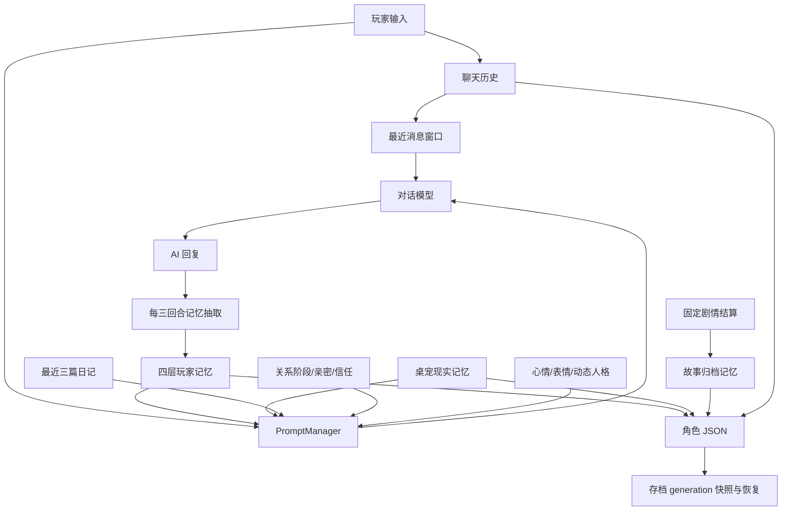
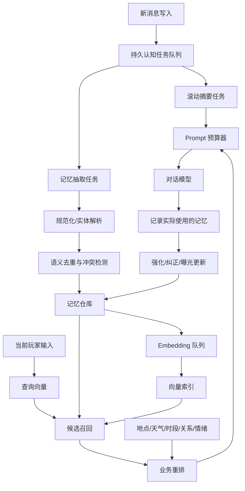

# Project AIRI 与 GalChat 记忆系统对比分析

> 调研日期：2026-07-23  
> AIRI 调研对象：[`moeru-ai/airi`](https://github.com/moeru-ai/airi) `main` 分支  
> GalChat 调研对象：当前工作区源码  
> 调研重点：工作记忆、长期记忆、向量检索、衰减与强化、持久化、上下文注入、故障恢复和测试

## 1. 执行摘要

Project AIRI 是一个面向 AI 虚拟角色、桌面伴侣和跨平台 Agent 的大型 monorepo。它对记忆系统提出了比普通聊天 RAG 更有野心的目标：模拟工作记忆、短期记忆、长期记忆和类似条件反射的“肌肉记忆”，并将时间、召回次数、情绪和随机回忆纳入排序。

但必须区分 AIRI 的三种状态：

1. **已经落地的基础设施**：聊天消息持久化、滑动上下文窗口、pgvector/HNSW 向量检索、多种 embedding 维度、PGlite 持久队列。
2. **已经展示的实验原型**：无状态遗忘曲线、相似度与时间相关性的组合排序、召回计数强化、记忆模拟器。
3. **仍在规划或 WIP 的 Alaya 记忆层**：情绪调制、短期到长期转化、梦境/潜意识重索引、随机闪回、完整多层记忆驱动。AIRI 自己的 README 仍将 Memory Alaya 标为 WIP。

GalChat 并不是“缺少记忆系统”。相反，GalChat 已经具有更贴近恋爱陪伴游戏的领域模型：

- `core / emotion / habit / bond` 四层玩家记忆；
- 玩家、桌宠现实域、固定剧情世界事实三类记忆隔离；
- 亲密度、信任度、关系阶段、心情、动态人格和日记上下文；
- 地点、天气、时段、参与者、来源和可见性元数据；
- 记忆衰减、场景化回访、纪念册与照片关联；
- 账号、存档、角色三级隔离以及 generation 快照恢复。

**GalChat 当前最大的欠缺不是数据模型，而是检索与生命周期闭环没有真正接通。**

目前所有主要聊天入口都把空数组作为 `query_embedding` 传给 Prompt 构建器，LLM 自动抽取的新记忆又通过 `add_memory_quick()` 写入空 embedding。因此，设置中虽然存在向量模型配置，系统绝大多数时候仍会把所有可见长期记忆直接注入 Prompt。随着游玩时间增长，这会带来上下文膨胀、召回噪声、成本上升和角色答非所问。

建议优先顺序：

| 优先级 | 建议 | 目标 |
| --- | --- | --- |
| P0 | 接通“玩家输入 embedding → 记忆检索 → Prompt 注入”链路 | 让现有向量能力真正工作 |
| P0 | 为所有新增/更新记忆建立可恢复的 embedding 队列 | 消除大面积空向量 |
| P0 | 增加 Prompt token/字符预算和分层配额 | 阻止长期上下文无限增长 |
| P1 | 引入滚动对话摘要和未总结游标 | 保存窗口外的短期上下文 |
| P1 | 建立抽取、向量化、合并、重试的持久任务队列 | 避免网络失败导致永久漏记 |
| P1 | 改造为语义、时间、重要性、情境和衰减的混合排序 | 提高相关性和自然回忆能力 |
| P1 | 语义去重、冲突检测和记忆版本审计 | 避免重复和错误覆盖 |
| P2 | 实现短期到长期巩固、周期重访、情绪调制 | 增强类人记忆表现 |

## 2. 调研边界与判断原则

本报告以源码和仓库内文档为依据，不以宣传描述代替实现证据。

对 AIRI 使用以下状态标记：

- **Implemented**：当前仓库存在可调用代码、数据库 schema 或明确运行链路。
- **Prototype**：DevLog 或实验平台给出实现与公式，但未形成主产品统一记忆模块。
- **Planned/WIP**：仓库明确标记未完成，或只有设计讨论。

这一区分很重要。例如 AIRI DevLog 讨论了情绪分数、PTSD 式随机闪回和梦境 Agent，但同时明确写明相关部分尚未完成。因此这些内容适合作为 GalChat 的长期设计参考，不应写成 AIRI 当前已经全面领先的生产能力。

## 3. Project AIRI 记忆系统调查

### 3.1 总体定位

AIRI 将记忆视为“意识运行时”的一个模块，而非单纯聊天记录。其公开设计受人类记忆分类启发：

- **Working memory**：当前 `messages` 数组或上下文窗口；
- **Short-term memory**：容易随时间衰减、近期更容易召回的 RAG 条目；
- **Long-term memory**：半衰期更长、经过多次召回或强化后更稳定的条目；
- **Muscle memory**：更接近固定刺激到固定动作的精确匹配或条件反射。

README 架构图中的目标链路为：

```text
DuckDB WASM
  -> Drizzle DuckDB driver
  -> Memory Alaya driver (WIP)
  -> Memory module
  -> AIRI Core
```

同时存在 PostgreSQL/pgvector 实现包 `@proj-airi/memory-pgvector`。当前该包主要是模块连接和配置壳，不能据此认定 Alaya 已完整实现。

### 3.2 当前已落地能力

#### 3.2.1 工作记忆和短期上下文

Satori Bot 的当前临时 Core 使用 `Map<string, ChatContext>` 保存活跃会话：

- 会话按 channel 延迟创建；
- 活跃上下文驻留内存直到进程退出；
- action 上下文有 `MAX_ACTIONS_IN_CONTEXT = 50` 和保留 20 条的裁剪策略；
-消息历史从数据库动态取最近 10 条；
- Prompt 文档将历史层描述为约 20 条 User/Assistant 消息的滑动窗口；
-最新输入、动作结果、当前时间和未读消息数作为动态状态放在上下文末尾。

这本质上是“持久消息日志 + 有界工作窗口”，不是完整长期人格记忆。

#### 3.2.2 消息与队列持久化

Satori Bot 已从 JSON 全量重写迁移到 PGlite + Drizzle ORM：

- `channels`：频道元数据；
- `messages`：持久消息日志，按频道和时间建立索引；
- `event_queue`：待处理事件队列；
- `unread_events`：按频道持久化未读事件；
-增量插入/删除，启动时自动 migration；
-崩溃后可以恢复事件队列和聊天上下文。

这个“认知任务可恢复”能力值得 GalChat 借鉴。GalChat 当前存档恢复较强，但记忆抽取和 embedding 请求本身不是可恢复任务。

#### 3.2.3 向量检索工程

Telegram Bot 的 `chat_messages` 和 `memory_short_term_ideas` schema 同时提供：

- `content_vector_1536`；
- `content_vector_1024`；
- `content_vector_768`；
-每种维度对应 HNSW `vector_cosine_ops` 索引。

查询时根据配置维度选择向量列，并使用：

$$
similarity = 1 - cosineDistance(query, memory)
$$

公开示例使用：

-相似度阈值 `0.5`；
-按相似度降序；
-取前 3 条。

仓库还提供历史消息批量补 embedding 脚本。这说明 AIRI 已考虑模型切换、维度变化和旧数据重建，而 GalChat 当前没有向量版本或批量回填机制。

#### 3.2.4 短期想法 schema

Telegram Bot 的 `memory_short_term_ideas` 包含：

- `content`；
- `source_type`：`dream / conversation / reflection`；
- `status`：`new / developing / implemented / abandoned`；
- `excitement`：1 到 10；
- `metadata`；
-创建与更新时间；
-三种 embedding 维度和 HNSW 索引；
-软删除时间。

这是一个有价值的 schema 原型，但当前搜索结果主要落在 schema 和 migration，尚不足以证明它已经形成完整的“想法生成 → 巩固 → 长期记忆 → Prompt 召回”主链路。

### 3.3 AIRI 的实验性排序与遗忘模型

AIRI DevLog 给出的时间半衰期模型是无状态计算：不需要后台任务持续修改每条记录，而是在查询时根据当前时间计算衰减。

若记忆初始强度为 $S_0$，半衰期为 $h$，经过时间 $t$ 后可表示为：

$$
S(t) = S_0 \cdot 2^{-t/h}
$$

早期示例将语义相关性与时间相关性组合：

$$
score = 1.2 \cdot similarity + 0.2 \cdot time\_relevance
$$

另一个示例用乘法组合：

$$
score = similarity \cdot time\_decay
$$

实验平台还通过召回次数 `+1` 模拟强化。AIRI 作者明确指出“召回等于强化”过于单维，真实系统还应考虑：

-快乐、厌恶、创伤等情绪分数；
-正负反馈；
-随机回忆或闪回；
-短期记忆向长期记忆迁移；
-后台“梦境/潜意识”式重索引。

这些是设计方向，不是当前主产品完整能力。

### 3.4 AIRI 当前局限

1. Memory Alaya 仍标记 WIP，主应用未形成统一、成熟、可验证的长期记忆闭环。
2. 主应用聊天会话持久化与 Telegram/Satori Bot 记忆原型分散在不同子系统。
3. `memory-pgvector` 仍接近模块壳层。
4. 情绪调制、梦境重索引、短期到长期巩固主要存在于设计与实验文章。
5. 向量检索示例更接近“相关历史消息检索”，角色关系语义和剧情世界隔离不如 GalChat 具体。

## 4. GalChat 当前记忆系统

### 4.1 总体架构



### 4.2 记忆数据模型

`MemoryManager` 提供四层记忆：

| 层 | 含义 | 当前衰减 |
| --- | --- | --- |
| `core` | 姓名、禁忌、核心价值、人生大事、不可逆选择 | 不衰减 |
| `emotion` | 情绪触发点、雷区、情感偏好 | 每剧情日增加 10 decay |
| `habit` | 作息、饮食、兴趣、日常习惯 | 每剧情日增加 10 decay |
| `bond` | 约定、共同经历、纪念日、共同完成事项 | 不自然衰减 |

每条记忆还可以包含：

- `id / content / timestamp`；
- `story_time / day_offset`；
- `decay / is_bond_mark`；
- `embedding`；
- `source_type / source_id / source_title`；
- `memory_domain`；
- `memory_scope`；
- `memory_visibility`；
- `memory_participants`；
-玩家是否参与/见证；
-剧情或现实时间域；
-地点、区域、天气、时段；
-现实日期、小时、温度。

这一领域模型比 AIRI 当前已落地主链更适合 GalChat 的陪伴和剧情需求。

### 4.3 记忆域与可见性

GalChat 已把容易污染角色认知的记忆分开：

- `player_memory`：玩家与角色之间的长期关系和偏好；
- `desktop_pet_memory`：现实桌宠场景；
- `story_memory`：固定剧情、NPC 社交和世界事实。

可见性分为：

- `prompt`：可直接进入对话 Prompt；
- `conditional`：有查询时才允许召回；
- `hidden`：不进入玩家对话；
- `archive_only`：仅归档展示。

`StoryMemoryManager.get_memory_prompt()` 当前固定返回空，避免 NPC 私人事件和世界事实无条件泄露给普通对话。这一隔离原则是正确的，但还缺少“根据当前剧情与角色权限安全检索”的读取通道。

### 4.4 写入与抽取

主要写入来源有两类：

1. **确定性写入**：固定剧情和约会结算根据脚本元数据写入，来源清晰，适合重要剧情事实。
2. **LLM 抽取**：剧情自由聊天和桌宠累计三个玩家回合后，请求模型输出 `ADD / UPDATE / DELETE` 操作。

抽取 Prompt 会附带当前记忆快照，并要求模型只维护当前记忆域。这个方向优于每轮简单摘要，因为它允许修正和删除旧记忆。

但当前实现存在四个关键问题：

- `ADD` 调用 `add_memory_quick()`，固定写入 `embedding: []`；
-共享 `memory_http` 遇到新请求会取消旧请求；
-只有一份 active/pending context，重叠请求可能覆盖上下文；
-失败、无效 JSON 和网络错误没有持久重试或补偿。

### 4.5 当前检索与注入

`MemoryManager.get_memory_prompt(query_embedding)` 的当前策略：

- `core` 层全量注入；
-有查询向量时，其他每层按余弦相似度排序，阈值 `0.4`，最多取 3 条；
-无向量或维度不匹配的条目标记为 `-1`，允许作为降级结果；
-没有查询向量时，所有可见 `emotion / habit / bond` 全量注入。

问题在于所有主要调用目前都明确传入空数组：

```gdscript
build_chat_prompt(profile, user_message, [])
build_system_prompt(profile, "mobile_chat", player_text, [])
build_system_prompt(profile, "desktop_pet", "", [], desktop_pet_memory_manager)
```

因此向量检索分支实际上基本不可达。

同时 Prompt 还直接注入最近三篇日记全文，没有 token 或字符预算。长期使用后，记忆和日记都会挤压真正需要的当前对话窗口。

### 4.6 衰减、强化与主动回访

GalChat 的 `emotion` 和 `habit` 使用离散剧情日衰减：

$$
decay_{new} = \min(100, decay_{old} + 10 \cdot days)
$$

再次强化会执行：

$$
decay_{new} = \max(0, decay_{old} - 50)
$$

但当前未发现 `reinforce_memory()` 的实际调用点，因此强化设计尚未接入聊天召回链路。

主动回访的权重由以下因素组成：

-基础值 `100 - decay`；
- `bond +50`，`emotion +20`；
-同时间域 `+30`；
-剧情地点相同 `+40`；
-天气相同 `+20`；
-时段相同 `+10` 或现实域 `+15`。

这比 AIRI 公开的“语义 + 时间”基础公式更贴近游戏情境。但 `revisited_memory_ids` 永久记录已回访项，导致一条记忆一生只能被主动回访一次，集合也会持续增长。

### 4.7 持久化和恢复

GalChat 的显著优势是账号、档案、角色三级隔离和 generation 快照：

```text
user://accounts/<account>/archives/<archive>/saves/<character>/
├── chat_history.json
├── player_memory.json
├── desktop_pet_memory.json
├── story_memory.json
├── character_profile.json
├── memory_album_state.json
└── photos/photo_metadata.json
```

SaveManager 会提交 manifest、SHA-256 和多代 generation，支持损坏恢复和代次保留。这比 AIRI 各子项目当前分散的记忆持久化更符合单机剧情游戏的完整存档语义。

不过，记忆文件本身仍是 JSON 全量读写；聊天历史没有容量上限；照片 generation 只覆盖元数据而非二进制文件；坏 JSON 多数静默变成空状态。

## 5. 能力对比矩阵

| 能力 | Project AIRI | GalChat | 判断 |
| --- | --- | --- | --- |
| 工作记忆 | 有界消息/动作窗口 | 最近 10 条为主，多频道类型 | 基本相当 |
| 聊天历史持久化 | PGlite/IndexedDB 等增量存储 | 角色级 JSON 全量存储 | AIRI I/O 扩展性更好 |
| 长期角色记忆 | Alaya WIP，Bot 有局部原型 | 四层记忆已进入角色 Prompt | GalChat 当前更完整 |
| 关系/剧情语义 | 通用角色卡和 Agent 状态 | 亲密、信任、阶段、剧情域、参与者 | GalChat 明显更强 |
| 向量数据库 | pgvector/HNSW，多维度列 | JSON 内数组，进程内线性余弦 | AIRI 更强 |
| 查询向量链路 | Telegram 消息检索已落地 | 主要调用全传空数组 | AIRI 更完整 |
| 旧数据向量回填 | 有批量脚本和维度意识 | 无统一回填/版本机制 | AIRI 更强 |
| 时间衰减 | 查询时无状态半衰期原型 | 剧情日离散 decay 并删除 | 各有侧重 |
| 情境召回 | 设计中强调情绪/随机 | 地点、天气、时段已落地 | GalChat 当前更强 |
| 记忆强化 | 召回计数原型 | 有函数但未接入 | 双方均未完整闭环 |
| 主动回忆 | 设计有随机回忆/闪回 | 每日按情境选择一次 | GalChat 已有可用实现 |
| 短期到长期巩固 | Alaya 设计目标 | 四层由 LLM 直接分类 | 双方均可加强 |
| 语义去重/冲突 | 未见统一成熟链路 | 仅完全字符串去重 | 双方均欠缺 |
| 抽取任务恢复 | PGlite 持久事件队列可借用 | 抽取请求失败即丢失 | AIRI 基础设施更强 |
| 存档隔离与回滚 | 子项目各自持久化 | 账号/档案/角色 + generation | GalChat 更强 |
| Prompt 预算 | 有界历史窗口 | 历史有界，长期记忆和日记无界 | GalChat 需补齐 |
| 记忆可视化 | AIRI 有实验平台 | 纪念册、照片、调试面板 | 各有优势 |
| 自动化测试 | 向量/会话层有单测 | 存档恢复强，记忆质量测试少 | 两者测试重点不同 |

## 6. GalChat 的关键欠缺

### 6.1 P0：向量检索没有进入生产聊天链路

这是最重要的问题。配置、客户端、存储字段和余弦函数都存在，但调用端没有为当前玩家输入生成 query embedding。

直接后果：

- `conditional` 记忆很难按设计召回；
-非核心记忆全量进入 Prompt；
-长期运行后噪声和 token 成本持续增长；
-设置里的 Embedding 能力对用户价值不明确。

### 6.2 P0：新记忆缺少 embedding 生命周期

AI 抽取是最常见的长期记忆来源，但它使用 `add_memory_quick()` 写空向量。需要建立：

- `embedding_status`：`pending / ready / failed / stale`；
- `embedding_model`；
- `embedding_dimension`；
- `embedding_version`；
-失败次数和下次重试时间；
-模型切换后的批量重建。

### 6.3 P0：长期上下文没有预算

当前 `core` 全量、其他层无查询时全量、最近三篇日记全文注入。建议明确预算：

| 区域 | 初始建议预算 |
| --- | ---: |
| 核心记忆 | 800 字符或 8 条 |
| 情绪记忆 | 3 条 |
| 习惯记忆 | 3 条 |
| 羁绊记忆 | 4 条 |
| 日记摘要 | 600 字符 |
| 总长期上下文 | 不超过模型输入预算的 20% |

超出预算时应按分数截断，而不是按文件顺序截断。

### 6.4 P1：没有滚动对话摘要

最近 10 条之外的对话直接消失于工作上下文。长期记忆抽取只保存“值得长期记住”的事实，无法代替话题级摘要。

建议新增每个频道独立的：

- `conversation_summary`；
- `summary_until_message_id`；
- `open_loops`：尚未解决的话题或承诺；
- `recent_entities`：近期人物、地点、物件；
- `last_topic`。

### 6.5 P1：认知任务不可恢复

抽取、embedding、语义合并都应进入持久任务队列。任务至少包含：

-任务 ID 和存档/角色 ID；
-任务类型；
-来源消息范围；
-输入内容 hash；
-状态和重试次数；
-幂等键；
-创建、下次执行和完成时间。

这可以借鉴 AIRI 的 PGlite `event_queue` 思路，但 GalChat 不一定需要引入 PostgreSQL；Godot 的 SQLite 插件或现有 JSON append log 都可先实现。

### 6.6 P1：检索排序过于单一

建议使用两阶段检索。

第一阶段候选召回：

-同存档、角色、记忆域和可见性过滤；
-向量 Top-K，例如 24 条；
-关键词/实体精确匹配补充；
-无向量记录按最近与重要性补充少量候选。

第二阶段业务排序可以采用：

$$
score = 0.50S + 0.14R + 0.12I + 0.10C + 0.08F + 0.06E - P
$$

其中：

- $S$：语义相似度；
- $R$：时间相关性；
- $I$：层级和羁绊标记的重要性；
- $C$：地点、天气、时段、人物等情境匹配；
- $F$：历史强化或成功召回；
- $E$：当前情绪与记忆情绪的一致/冲突调制；
- $P$：重复、过度曝光、冲突或低置信度惩罚。

权重应通过回放测试调参，而不是长期硬编码。

### 6.7 P1：去重、冲突和审计不足

当前只比较同层完整字符串。建议新增：

-标准化 hash 去重；
-向量相似度大于阈值的近重复检测；
-同一 subject/predicate 的冲突检测；
-`supersedes`、`contradicts`、`derived_from` 关系；
-更新前版本和操作来源审计；
-低置信度操作进入待确认区，而非直接删除。

### 6.8 P1：覆盖入口不一致

剧情自由聊天和桌宠有抽取触发，但主聊天、手机聊天和其他独立 AI 通道没有一致链路。应把“消息提交后的记忆观察”下沉为统一服务，由频道策略决定是否抽取，而不是每个 UI 自己调用。

### 6.9 P2：强化和遗忘尚未形成闭环

`reinforce_memory()` 没有实际调用。更合理的规则是区分：

-仅被检索：增加曝光，不一定强化；
-被角色实际用于回答且反馈良好：强化；
-被用户纠正：降低置信度或标记冲突；
-被再次明确提及：强强化并更新时间；
-长期无关：按半衰期自然降低可召回性，但不必立即物理删除。

建议把“删除”改成先归档或软删除。永久删除应只用于用户明确要求遗忘、隐私清理或确认错误。

### 6.10 P2：故事记忆读取能力不足

`StoryMemoryManager` 完成了安全隔离，却没有条件读取。可以增加基于以下条件的故事事实检索：

-当前剧情脚本和章节；
-当前地点；
-在场角色；
-玩家是否见证；
-角色是否有权限知道；
-剧情时间是否已经发生。

这样既避免剧透和越权，又能让固定剧情真正影响后续对话。

## 7. 推荐目标架构



### 7.1 推荐记忆记录结构

```json
{
  "id": "memory-id",
  "content": "玩家不喜欢被突然催促",
  "layer": "emotion",
  "domain": "player_memory",
  "scope": "player_shared",
  "visibility": "prompt",
  "status": "active",
  "confidence": 0.86,
  "importance": 0.72,
  "valence": -0.35,
  "arousal": 0.62,
  "created_at": "...",
  "last_confirmed_at": "...",
  "last_recalled_at": "...",
  "recall_count": 3,
  "successful_use_count": 1,
  "contradiction_count": 0,
  "half_life_days": 45,
  "source_refs": ["message-id"],
  "entities": ["player"],
  "context": {
    "location": "library",
    "weather": "rain",
    "period": "evening"
  },
  "embedding": [],
  "embedding_model": "model-id",
  "embedding_dimension": 1024,
  "embedding_version": 1,
  "embedding_status": "ready",
  "supersedes": [],
  "contradicts": []
}
```

不建议一次性迁移全部字段。P0 只需先增加向量状态、重要性、置信度、最近使用时间和来源消息引用。

### 7.2 无向量降级策略

Embedding 是本地模式可选能力，因此系统必须有可预测的降级：

1. 精确实体/关键词匹配；
2. 层级重要性；
3. 最近确认时间；
4. 当前地点、天气、时段匹配；
5. 每层固定小配额。

不能继续把所有无向量记忆都视作“符合阈值”。当前 `score == -1` 的做法会让降级候选与真正相似候选混在同一排序空间。

## 8. 分阶段实施路线

### 阶段 A：让已有能力闭环（P0）

1. 新增统一 `MemoryRetrievalService`。
2. 在聊天前为玩家输入生成 query embedding。
3. 所有入口统一调用检索服务，不再手动传 `[]`。
4. `add_memory_quick()` 写入 `pending` embedding 状态。
5. 后台或空闲帧执行 embedding 队列。
6. 增加 Prompt 预算器和每层最大条数。
7. 设置中展示向量索引状态、待处理数量和降级说明。

验收指标：

-开启 embedding 时，相关记忆可稳定进入 Top-K；
-关闭 embedding 时，Prompt 大小仍有上限；
-1000 条记忆时对话 Prompt 不随总量线性增长；
-模型切换后可以重建旧向量。

### 阶段 B：提高可靠性（P1）

1. 建立持久认知任务队列。
2. 增加滚动摘要和未总结游标。
3. 统一所有聊天通道的记忆观察入口。
4. 增加语义去重、冲突检测和操作审计。
5. 记忆抽取失败自动指数退避重试。
6. 存档切换时取消当前任务并按 archive ID 恢复正确队列。

验收指标：

-断网、退出、崩溃后任务可恢复；
-同一消息范围不会重复抽取；
-跨存档任务绝不串档；
-相同事实不同措辞不会无限新增。

### 阶段 C：角色化记忆（P2）

1. 实现查询时半衰期，不再依赖批量物理删除。
2. 记录召回、实际使用、用户确认和纠正四类反馈。
3. 为记忆增加 valence/arousal，但先用于排序，不直接模拟心理疾病。
4. 实现短期记忆巩固和周期复盘。
5. 允许故事事实按知识权限安全召回。
6. 将永久一次性的 `revisited_memory_ids` 改为冷却时间和曝光惩罚。

### 阶段 D：实验能力（P3）

可以研究 AIRI 提出的梦境重索引、随机闪回和欲望系统，但应满足：

-用户可关闭；
-所有自动改写可审计和撤销；
-不把负面情绪或创伤模拟包装成医学真实性；
-随机回忆不能突破剧情知识权限和隐私边界。

## 9. 建议测试矩阵

### 9.1 单元测试

-余弦相似度和维度不匹配；
-半衰期公式；
-混合排序各权重；
-Prompt 预算截断；
-四层和可见性过滤；
-无向量降级排序；
-语义近重复与冲突；
-记忆强化、纠正和软删除；
-故事知识权限。

### 9.2 集成测试

-消息写入后生成抽取任务；
-抽取 ADD 后生成 embedding 任务；
-embedding 完成后可被下一轮检索；
-网络失败后重试；
-模型切换后向量标记 stale 并重建；
-切换角色/存档时任务和结果隔离；
-摘要游标不会跳过或重复消息。

### 9.3 质量回放集

建议建立一组匿名化固定对话回放，每条标注：

-应召回记忆；
-不应召回记忆；
-是否允许跨剧情域；
-期望层级；
-是否应更新、合并或删除；
-最大 Prompt 预算。

核心指标：

$$
Recall@K = \frac{\text{应召回且进入 Top-K 的记忆数}}{\text{应召回记忆总数}}
$$

$$
Precision@K = \frac{\text{Top-K 中真正相关的记忆数}}{K}
$$

还应统计：

-错误跨域召回率；
-重复记忆增长率；
-抽取任务成功率；
-embedding 待处理时延；
-每轮长期上下文 token 数；
-用户纠正后仍错误召回的次数。

## 10. 最终判断

Project AIRI 最值得 GalChat 学习的不是某个可以直接复制的“完整记忆模块”，而是以下工程思想：

1. 把向量索引当作有版本、可回填、可迁移的数据资产；
2. 使用 ANN/HNSW 做候选召回，再用业务字段重排；
3. 查询时计算无状态时间衰减，避免持续全表更新；
4. 让事件与认知任务可持久化恢复；
5. 把召回、强化、情绪和长期巩固视为不同过程。

GalChat 已经拥有 AIRI 当前主线仍在建设的许多角色化能力：关系阶段、剧情时间、现实时间、地点天气、羁绊、日记、故事权限、照片和完整存档恢复。现阶段不应推翻重写，也不应为了“像 AIRI”而立即引入复杂数据库。

最合理的路线是保留现有领域模型，优先补齐：

> **统一检索服务 + embedding 生命周期 + Prompt 预算 + 持久认知任务队列 + 滚动摘要。**

完成这五项后，GalChat 的记忆系统才会从“拥有丰富记忆文件”升级为“能稳定写入、正确召回、控制成本、故障可恢复、长期可演进”的完整闭环。

## 11. 主要参考资料

### Project AIRI

- [Project AIRI GitHub 仓库](https://github.com/moeru-ai/airi)
- [AIRI README 架构图与 Memory Alaya WIP 状态](https://github.com/moeru-ai/airi/blob/main/README.md)
- [DevLog 2025-04-06：Vector DB、Embedding 与基础检索](https://github.com/moeru-ai/airi/blob/main/docs/content/en/blog/DevLog-2025.04.06/index.md)
- [DevLog 2025-04-14：遗忘曲线、重排、情绪记忆设想](https://github.com/moeru-ai/airi/blob/main/docs/content/en/blog/DevLog-2025.04.14/index.md)
- [Telegram Bot 数据库 Schema](https://github.com/moeru-ai/airi/blob/main/services/telegram-bot/src/db/schema.ts)
- [Telegram Bot 消息向量模型](https://github.com/moeru-ai/airi/blob/main/services/telegram-bot/src/models/chat-message.ts)
- [Satori Bot 持久化架构](https://github.com/moeru-ai/airi/blob/main/services/satori-bot/docs/PERSISTENCE.md)
- [Satori Bot Prompt 上下文架构](https://github.com/moeru-ai/airi/blob/main/services/satori-bot/docs/PROMPTS.md)
- [`@proj-airi/memory-pgvector`](https://github.com/moeru-ai/airi/tree/main/packages/memory-pgvector)

### GalChat

- [`MemoryManager`](../scripts/data/memory_manager.gd)
- [`PromptManager`](../scripts/data/prompt_manager.gd)
- [记忆抽取服务](../scripts/api/services/deepseek/deepseek_memory_emotion_service.gd)
- [`DoubaoEmbeddingClient`](../scripts/api/doubao_embedding_client.gd)
- [`ChatHistoryManager`](../scripts/data/chat_history_manager.gd)
- [`StoryMemoryManager`](../scripts/data/story_memory_manager.gd)
- [`DesktopPetMemoryManager`](../scripts/data/desktop_pet_memory_manager.gd)
- [`MemoryAlbumManager`](../scripts/data/memory_album_manager.gd)
- [`PhotoMemoryManager`](../scripts/data/photo_memory_manager.gd)
- [`SaveManager`](../scripts/data/save_manager.gd)
- [`GameDataManager`](../scripts/data/game_data_manager.gd)