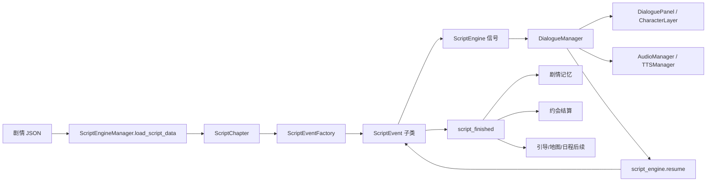
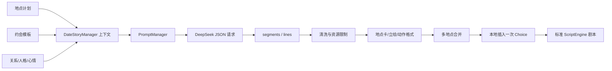
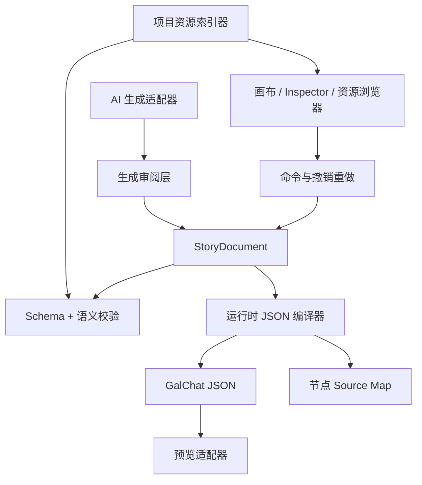

# GalChat 剧情编辑器设计规格

## 1. 文档目标

本文档基于 GalChat 当前代码与数据协议，定义一套面向策划、编剧和开发者的节点式剧情编辑器。

编辑器需要同时覆盖：

- 固定主线、固定事件和引导剧情。
- ScriptEngine 驱动的对白、背景、立绘、声音、变量和流程事件。
- 动态 AI 约会的模板、提示词、生成、清洗、保底、分支和结算。
- 固定剧情中嵌入的 AI 临时聊天。
- 主界面的日常、心事、主线话题和记忆回访 AI 对话。
- 手机固定聊天和手机消息选项。
- 地图、日程、引导和事件注册表对剧情的引用。

编辑器不应只做 JSON 表单。核心目标是把“触发条件、场景流程、演出状态、分支、AI 生成和结算”放在同一套可验证工作流中，同时保持现有运行时 JSON 的兼容性。

---

## 2. 当前剧情系统全景

### 2.1 内容类型

| 内容类型 | 主要数据位置 | 运行入口 | 执行模型 |
|---|---|---|---|
| 固定主线剧情 | `assets/data/story/scripts/main/` | 日程、引导、直接加载 | ScriptEngine 线性事件 |
| 地图自动事件 | `assets/data/story/scripts/events/` | EventManager 条件匹配 | ScriptEngine 线性事件 |
| 固定通话 | `assets/data/story/scripts/calls/fixed_calls.json` | `voice_call` 事件 | 通话 UI 独立播放 |
| 动态 AI 约会 | `assets/data/interaction/date_*.json` | DateGenerationController | AI 片段生成后编译为 ScriptEngine 数据 |
| 固定剧情内 AI 对话 | 固定剧情中的 `ai_chat`/`start_free_chat` | DialogueManager | ScriptEngine 暂停，AI 对话结束后恢复 |
| 主界面 AI 对话 | 无固定剧本文件 | MainScene | 流式聊天状态机 |
| 手机固定聊天 | `assets/data/mobile/fixed_chats/` | MobileFixedChatManager | 消息状态图 |
| 引导剧情引用 | `assets/data/guide/guide_flows.json` | GuideManager | 引导步骤引用固定剧情 |
| 地图剧情引用 | `assets/data/events/event_registry.json` | EventManager | 条件触发器引用固定剧情 |
| 课程随机事件 | `assets/data/interaction/activity/` | 日程系统 | 事件描述、选项和结算，不经过 ScriptEngine |

### 2.2 推荐的编辑器工作区

剧情编辑器应提供四种文档模式，而不是把所有系统强行塞进一种图：

1. **演出剧情图**：固定剧情、地图事件、动态约会编译结果。
2. **AI 约会模板**：约会模板、创意变量、Prompt 预览和生成结果审阅。
3. **手机消息图**：固定聊天消息及 `next` 跳转。
4. **触发器图**：地图事件、引导步骤、日程入口和完成后动作。

它们共享资源浏览器、角色浏览器、诊断系统和版本控制界面。

---

## 3. 当前运行时架构



### 3.1 加载过程

`ScriptEngineManager.load_script_data()` 完成以下工作：

1. 接收 Dictionary 类型的根数据。
2. 读取 `script_id` 和根级元数据。
3. 将 `chapters` 中每个章节转换为 `ScriptChapter`。
4. `ScriptChapter` 使用 `ScriptEventFactory` 把事件 Dictionary 转换为事件对象。
5. 从 `start` 章节开始执行。

当前加载器只做非常有限的结构检查。未知事件会退化为基础事件并被静默跳过，因此编辑器必须承担严格校验责任。

### 3.2 执行状态

运行时核心状态：

- `current_script_id`
- `current_chapter_id`
- `current_event_index`
- `is_running`
- `is_waiting_for_resume`

非阻塞事件会在同一循环中连续执行。阻塞事件返回 `true` 后，运行时暂停，等待 UI 或异步流程调用 `resume()`。

### 3.3 阻塞语义

| 类型 | 是否阻塞 | 恢复来源 |
|---|---:|---|
| 对白 | 是 | 文本完成后的推进点击 |
| 选择 | 是 | 玩家选择一个选项 |
| 时段地点卡 | 是 | 卡片动画完成 |
| 背景 | `duration > 0` 时阻塞 | 背景过渡完成 |
| AI 临时聊天 | 是 | 玩家结束 AI 聊天 |
| 自由聊天 | 是 | 当前实现进入模式后由处理器控制恢复 |
| 固定通话 | 是 | 通话结束 |
| 玩家称呼弹窗 | 是 | 玩家提交称呼 |
| 立绘/声音/变量 | 否 | 自动继续 |

编辑器节点必须直观显示阻塞属性，例如在节点标题旁显示暂停图标。

---

## 4. 固定剧情文档协议

### 4.1 根结构

```json
{
  "script_id": "luna_example_story",
  "story_location_id": "library",
  "story_area_id": "",
  "day_offset": 0,
  "story_period": "下午",
  "use_portraits": true,
  "cover_image": "story_cover_id",
  "summary": "剧情摘要",
  "memory_enabled": true,
  "memory_records": [],
  "chapters": {
    "start": {
      "events": []
    }
  }
}
```

### 4.2 根字段

| 字段 | 类型 | 必填 | 说明 |
|---|---|---:|---|
| `script_id` | String | 是 | 全项目唯一 ID |
| `chapters` | Dictionary | 是 | 章节表，必须含 `start` |
| `story_location_id` | String | 否 | 地图地点 ID |
| `story_area_id` | String | 否 | 地图区域 ID |
| `day_offset` | int | 否 | 相对故事日偏移 |
| `story_period` | String | 否 | 上午、下午、夜晚等显示值 |
| `use_portraits` | bool | 否 | 是否启用故事立绘，默认 true |
| `cover_image` | String | 否 | 封面图片 ID；编辑器应统一为资源 ID |
| `summary` | String | 否 | 剧情摘要，也是记忆兜底内容 |
| `memory_enabled` | bool | 否 | 是否记录剧情记忆 |
| `memory_records` | Array | 否 | 显式记忆记录 |
| `runtime_generated` | bool | 运行时 | 动态生成剧情标记 |
| `story_category` | String | 运行时 | 如 `date_dynamic` |
| `date_plan` | Array | 运行时 | 动态约会计划 |
| `date_settlement` | Dictionary | 运行时 | 约会完成结算 |

### 4.3 记忆记录

```json
{
  "title": "共同经历",
  "layer": "bond",
  "scope": "player_shared",
  "visibility": "prompt",
  "participants": ["player", "luna"],
  "player_involved": true,
  "player_witnessed": true,
  "is_bond_mark": true,
  "content": "玩家与 Luna 在图书馆共同经历了一次重要交流。"
}
```

编辑器应提供结构化选择器，不允许作者记忆这些枚举。

推荐 `scope`：

- `player_shared`
- `player_observed`
- `private_self`
- `npc_social`
- `world_fact`

推荐 `visibility`：

- `prompt`
- `conditional`
- `hidden`
- `archive_only`

---

## 5. 事件节点规格

### 5.1 Dialogue 对白节点

```json
{
  "type": "dialogue",
  "speaker": "luna",
  "content": "（看向窗外）今天的雨好像没有停下来的意思。",
  "mood": "calm",
  "character": "luna",
  "expression": "calm",
  "focus": true,
  "display_name": "Luna"
}
```

Inspector：

- 发言者：角色选择器，支持 `旁白`、`player`、`char` 和角色 ID。
- 文本：多行富文本编辑器。
- 动作描述格式检查：句首最多一个中文全角括号动作。
- 表情：根据角色配置提供枚举和预览。
- 聚焦：三态控件，允许未指定、true、false。
- 显示名：可选覆盖。
- TTS 预览：去除括号动作后试听。

运行行为：逐字速度每字符约 `0.05s`，最低 `0.5s`。首击补全文本，次击停止语音并推进。玩家与旁白默认不生成 TTS。

### 5.2 Choice 选择节点

当前协议：

```json
{
  "type": "choice",
  "options": [
    {
      "id": "date_intimacy",
      "text": "主动靠近她，坦率说出心意",
      "kind": "intimacy",
      "response": "（向她靠近一些）我更在意今天陪在我身边的人。",
      "effects": {
        "intimacy": 6,
        "trust": 2
      }
    },
    {
      "id": "date_trust",
      "text": "认真接住她的话",
      "kind": "trust",
      "response": "不用急着回答，我会认真听你说完。",
      "effects": {
        "intimacy": 2,
        "trust": 6
      }
    }
  ]
}
```

现有 UI 会复用亲密/信任图标、颜色和标题。`effects.intimacy` 与 `effects.trust` 会分别限制在 $[0,10]$。

当前限制：

- `target_chapter` 虽然会被归一化保留，但 DialogueManager 尚未使用它。
- 当前 choice 只产生不同回应和数值，不会跳入不同章节。
- 当前不支持负数效果、其他属性、条件隐藏或技能检定。

编辑器策略：

- MVP 中允许“回应型选择”，两个端口最终汇回同一后续节点。
- 真分支端口应显示为实验能力，并在导出时阻止输出，直到运行时支持 `target_chapter`。
- 选择项至少有 `id`、`text`、`kind`。
- 每项的 `effects` 使用数值步进器，并显示总奖励差异。
- 同一 choice 中 option ID 必须唯一。

### 5.3 Background 背景节点

```json
{
  "type": "background",
  "bg_id": "library_evening",
  "transition_type": "dissolve",
  "duration": 0.5
}
```

支持的过渡类型：

- `fade`
- `blur`
- `shatter`
- `pixelate`
- `dissolve`
- `glitch`
- `wipe_right`
- `wipe_left`
- `wipe_up`
- `wipe_down`
- `slide_left`
- `slide_up`
- `zoom`

Inspector 应展示图片缩略图、资源 ID、过渡预览和时长。

### 5.4 Period Card 时段地点卡

```json
{
  "type": "period_card",
  "bg_id": "sakura_avenue",
  "period_label": "上午",
  "location_name": "樱花大道",
  "hold_duration": 3.0
}
```

该节点会清空对白、停止语音、隐藏当前 UI 和立绘，显示地点卡后恢复。

### 5.5 Show Character 角色入场

```json
{
  "type": "show_character",
  "character": "luna",
  "position": "center",
  "expression": "calm",
  "focus": true,
  "display_name": "Luna",
  "animation": "fade_in"
}
```

### 5.6 Move Character 角色移动

字段与入场节点基本一致，默认动画为 `move`。

### 5.7 Hide Character 角色退场

```json
{
  "type": "hide_character",
  "character": "luna",
  "animation": "fade_out"
}
```

### 5.8 Audio 通用声音节点

```json
{
  "type": "audio",
  "audio_id": "rain_loop",
  "audio_type": "bgs",
  "action": "play",
  "fade_time": 0.5,
  "loop": true
}
```

`audio_type`：`bgm`、`bgs`、`se`。

`action`：`play`、`stop`、`switch`。

### 5.9 BGM 兼容节点

当前同时存在 ID 与路径两套协议：

```json
{
  "type": "bgm",
  "audio_id": "luna_bgm",
  "action": "switch",
  "fade_time": 1.0,
  "loop": true
}
```

旧数据还可能使用 `audio_path`。编辑器内部应统一使用 `audio_id`，导入旧路径时生成迁移警告。

### 5.10 Set Variable 变量节点

```json
{
  "type": "set_variable",
  "var_name": "met_luna_in_library",
  "var_value": true
}
```

变量写入 `GameDataManager` meta。当前没有表达式、比较或持久化声明，编辑器应把它标为运行时 Meta，而不是完整剧情变量系统。

### 5.11 Jump 跳转节点

```json
{
  "type": "jump",
  "target_chapter": "end"
}
```

当前只建议使用 `target_chapter: "end"`。

已知风险：跨章节跳转时，事件内部修改了章节和索引，但 ScriptEngine 外层循环仍可能递增旧索引并持有旧章节引用。编辑器在该运行时缺陷修复前，应把跨章跳转视为导出错误或高危警告。

### 5.12 AI Chat 临时 AI 对话节点

```json
{
  "type": "ai_chat",
  "prompt_override": "围绕刚才发现的日记内容进行一次克制而真诚的交流。"
}
```

运行时暂停固定剧情，进入临时 AI 对话。玩家结束聊天后固定剧情恢复。

Inspector 应包含：

- 对话目标。
- 角色边界。
- 不允许偏离的话题。
- 退出条件说明。
- Prompt 预览。

### 5.13 Start Free Chat 自由对话节点

```json
{
  "type": "start_free_chat",
  "strategy": "让玩家围绕今天的钢琴练习自由交流。",
  "max_rounds": 3
}
```

### 5.14 Voice Call 固定通话节点

```json
{
  "type": "voice_call",
  "call_id": "luna_first_call"
}
```

编辑器必须从 `fixed_calls.json` 选择 call ID，并提供通话内容预览。

### 5.15 Player Call Name 玩家称呼节点

```json
{
  "type": "show_player_call_name_popup"
}
```

该节点弹出玩家称呼设置，提交后恢复剧情。

---

## 6. AI 剧情系统

### 6.1 AI 剧情不应直接等同于节点图

当前动态 AI 约会采用“约束生成 + 本地编译”模式：



编辑器应同时展示三层数据：

1. **生成输入层**：计划、模板、人物状态、创意变量。
2. **模型原始层**：AI 返回的 summary 与 segments。
3. **运行时编译层**：最终 chapters/events。

这样策划才能判断问题来自 Prompt、模型输出还是本地后处理。

### 6.2 AI 约会输入

输入包括：

- 日期、天气、温度和时段。
- 地点 ID、名称、描述和背景 ID。
- 约会类型。
- 模板 ID、标题、大纲、必须桥段和情绪标签。
- 关系阶段、阶段边界、亲密度和信任度。
- 关系风味、心情、表情、基础人格和动态人格。
- 前段摘要。
- 创意种子。
- 随机共同任务、微小意外、谈话主题和收束方式。

### 6.3 模型响应协议

```json
{
  "summary": "40 到 90 字摘要",
  "segments": [
    {
      "lines": [
        {"speaker": "旁白", "content": "..."},
        {"speaker": "luna", "content": "..."},
        {"speaker": "player", "content": "..."}
      ]
    }
  ]
}
```

正常请求每段 10 到 12 行；重试模式 7 到 9 行。模型不负责生成章节外壳、背景事件、立绘事件、Choice 或结算。

### 6.4 清洗与编译规则

- 只接受合法 speaker：旁白、player、当前角色。
- 背景只能使用当前约会计划中的背景 ID。
- 无有效对白时使用一次本地 fallback。
- 每个地点插入背景或时段地点卡。
- 第一个音频事件保留，后续重复 BGM 被移除。
- 立绘显示/隐藏由本地后处理重建。
- 每句最多保留一个括号动作，移动到句首并显示绿色。
- 多地点合并后只插入一个约会 Choice。
- 约会基础 settlement 与 Choice 即时奖励分别执行一次。

### 6.5 AI 约会编辑工作台

建议提供以下面板：

- 模板列表：按地点、类型、时段和天气筛选。
- 变体权重编辑器。
- 共同任务、意外、谈话主题、收束方式候选池。
- 关系阶段模拟器。
- Prompt 拼装预览。
- 固定随机种子输入。
- 一次生成、多次批量生成和差异对比。
- 原始 JSON、清洗结果和最终事件图三栏对比。
- 重复度报告：动作、句式、桥段、收束方式和模板命中率。
- Fallback 使用原因。
- Token、请求耗时和重试次数。

### 6.6 AI 内容审核规则

编辑器应为 AI 结果提供自动检查：

- 地点名称只出现但没有地点专属行为。
- 不同地点共享高度相似的核心事件。
- 同段重复动作描述。
- 高频泛化词，如“气氛变得柔和”“时间慢慢过去”。
- 关系阶段越界。
- 角色人格偏离。
- 玩家替角色做决定。
- 同一情感结论重复出现。
- 末段没有收束或突然结束。
- 模型输出了 BBCode、Markdown 或非法 speaker。

---

## 7. 普通 AI 对话与剧情编辑器的关系

### 7.1 对话频道

主界面 AI 对话使用 `type=main_chat`，并通过 subtype 区分：

- `daily_chat`
- `daily_topic_chat`
- `daily_concern_chat`
- `daily_story_topic_chat`
- `daily_memory_revisit`
- `daily_proactive`

故事场景 AI 使用 `type=story_chat` 和 `conversation_subtype`。

固定故事对白历史使用 `fixed_story`。

### 7.2 编辑器中的 AI Chat 节点

AI Chat 节点不是预先确定的对白链。编辑器应编辑的是：

- 频道类型和 subtype。
- Prompt 策略。
- 初始系统上下文。
- 最大轮数。
- 是否允许玩家主动结束。
- 结束后固定剧情的恢复点。
- 推荐选项是否开启。
- 情绪分析是否开启。
- 记忆提取是否开启。

### 7.3 历史隔离警告

当前推荐选项生成会按 subtype 过滤历史，但部分聊天正文历史读取仍主要按 type 过滤。编辑器 UI 应把 subtype 标注为“逻辑频道”，并在运行时完成严格过滤前显示上下文共享警告。

---

## 8. 手机固定聊天协议

手机固定聊天使用独立格式：

```json
{
  "id": "jing_invite",
  "character_id": "jing",
  "messages": [
    {
      "id": "m1",
      "speaker": "jing",
      "text": "你现在有空吗？"
    },
    {
      "id": "m2",
      "speaker": "player_options",
      "options": [
        {
          "id": "opt_yes",
          "text": "有空，怎么了？",
          "next": "m3"
        }
      ]
    }
  ],
  "on_complete_events": []
}
```

手机消息节点应支持：

- 文本消息。
- 图片消息。
- 语音消息与时长。
- 延迟。
- 玩家选项。
- `next` 消息引用。
- 完成事件：激活目标、激活主聊天话题。

手机图与 ScriptEngine 图不应混用，因为二者跳转和 UI 协议不同。

---

## 9. 触发器与外部引用

### 9.1 地图事件

EventManager 会根据以下条件匹配自动事件：

- 地点或区域。
- 天气。
- 时段。
- NPC 状态。
- 关系阶段。
- 是否已经完成。
- 其他注册表条件。

编辑器应提供“触发器视图”，显示每个剧情由谁引用，以及多个事件条件是否可能冲突。

### 9.2 引导系统

GuideManager 的 `play_story` 步骤通过路径引用固定剧情。编辑器应提供反向引用，避免剧情文件改名后引导静默失效。

### 9.3 日程系统

部分日程事件通过约定路径映射到 `assets/data/story/scripts/main/{event_id}.json`。编辑器应验证约定文件是否存在。

### 9.4 Post Events

部分固定剧情存在根级 `post_events`，由 ScriptEngine 之外的系统消费。编辑器必须保留未知根字段，并为已知 post event 提供独立 Inspector，不能在导入导出时丢失。

---

## 10. 节点编辑器领域模型

### 10.1 内部文档格式

建议编辑器使用独立的版本化工程格式 `*.galstory.json`：

```json
{
  "schema_version": 1,
  "editor_version": "0.1.0",
  "document_id": "luna_example_story",
  "metadata": {},
  "variables": [],
  "graphs": {
    "start": {
      "nodes": [],
      "edges": []
    }
  },
  "runtime_extensions": {},
  "source_snapshot": {}
}
```

不要立即把现有运行时 JSON 改成图格式。编辑器在导出时将图编译为当前 `chapters.events`，以降低对游戏运行时的侵入。

### 10.2 节点稳定 ID

每个编辑器节点必须有不可变 `node_id`，不能使用数组索引作为身份。建议格式：

```text
node_dialogue_01J8Y...
```

稳定 ID 用于：

- Git 合并。
- 错误定位。
- 注释和审阅。
- 运行时断点映射。
- 导入后保持画布布局。

### 10.3 节点分类

**Flow**

- Start
- End
- Jump
- Choice
- Chapter Reference

**Presentation**

- Dialogue
- Background
- Period Card
- Show Character
- Move Character
- Hide Character
- Audio
- BGM

**Interaction**

- Player Call Name
- Voice Call
- Choice Response

**AI**

- AI Chat
- Start Free Chat
- AI Date Segment
- Prompt Context

**State**

- Set Variable
- Condition，未来能力
- Relationship Effect
- Memory Record

**Integration**

- Guide Trigger
- Map Event Trigger
- Goal Activation
- Main Chat Topic Activation

### 10.4 端口语义

| 颜色 | 端口类型 | 说明 |
|---|---|---|
| 白色 | Flow | 普通执行流 |
| 黄色 | Choice Branch | 选择项分支 |
| 青色 | Chapter Reference | 章节引用 |
| 蓝色 | Resource | 图片、音频、角色资源 |
| 绿色 | Value | 变量和值 |
| 橙色 | Completion | 完成后动作 |

MVP 只需把节点之间的白色 Flow 编译为事件数组。Choice 真分支和条件节点应在运行时支持完成后再开放导出。

---

## 11. 界面布局

参考目标图，推荐采用四区结构。

### 11.1 顶部工具栏

- 新建剧情。
- 打开和最近文件。
- 保存。
- 适应视图。
- 导入运行时 JSON。
- 导出运行时 JSON。
- 验证。
- 预览运行。
- 查看 JSON Diff。
- 帮助与快捷键。

必须明确显示未保存状态。导出不等于保存：保存写编辑器工程，导出生成游戏运行时 JSON。

### 11.2 左侧导航

- 全部剧情。
- 按章节、阶段、角色、地点、内容类型分组。
- 搜索 script ID、标题和正文。
- 筛选错误、警告、未引用和已修改内容。
- 显示剧情入口和外部引用数量。

### 11.3 中央画布

- 节点拖放和框选。
- 自动布局。
- 小地图。
- 缩放。
- 折叠章节。
- 节点注释组。
- 当前运行位置高亮。
- 未连接端口和不可达节点提示。
- 阻塞节点标记。

建议默认节点卡片只展示最重要摘要：

- 对白：speaker + 前 30 字。
- 背景：缩略图 + 过渡类型。
- Choice：选项数量和奖励倾向。
- AI Chat：策略摘要和轮数。
- 章节：事件数、预计对白轮数、目标。

### 11.4 右侧 Inspector

Inspector 由字段描述表驱动，不应为每个节点硬编码一套表单。

字段描述至少包含：

- 字段名。
- 显示名。
- 类型。
- 是否必填。
- 默认值。
- 枚举。
- 最小值和最大值。
- 资源类别。
- 条件可见性。
- 帮助文本。
- 运行时支持等级。

### 11.5 底部面板

- 错误与警告。
- 运行日志。
- AI 原始输出。
- 编译后 JSON。
- Git Diff。
- 资源引用。
- 变量与结算变化。

---

## 12. 资源浏览器

资源选择必须基于项目注册数据，而不是自由文本。

| 资源 | 数据源 |
|---|---|
| 图片和背景 | `assets/data/images/image_data.json` |
| 音频 | `assets/data/audio/audio_data.json` |
| 表情 | `assets/data/mood/expression_config.json` |
| 主角色 | `assets/data/characters/` |
| NPC | `assets/data/characters/npc/` 与地图数据 |
| 地点 | `assets/data/map/` |
| 固定通话 | `assets/data/story/scripts/calls/fixed_calls.json` |
| 目标 | 目标系统数据 |
| 手机固定聊天 | `assets/data/mobile/fixed_chats/` |

资源浏览器能力：

- 文本搜索和标签筛选。
- 图片缩略图。
- 音频试听和时长。
- 表情预览。
- 角色立绘预览。
- 反向引用。
- 缺失和孤立资源检查。

---

## 13. 编译与导出

### 13.1 编译原则

编辑器工程图不是运行时格式。发布编译器负责：

1. 从 Start 节点遍历 Flow。
2. 将线性节点转换为 `events` 数组。
3. 按章节生成 `chapters`。
4. 把资源引用输出为运行时 ID。
5. 移除编辑器布局、注释和 node ID，或输出到独立 source map。
6. 保留导入时未知的根字段和扩展字段。
7. 运行完整校验。
8. 格式化 JSON 并生成 Diff。

### 13.2 Source Map

建议额外生成：

```json
{
  "script_id": "luna_example_story",
  "events": {
    "start:0": "node_background_01",
    "start:1": "node_dialogue_02"
  }
}
```

运行时错误即可映射回编辑器节点。

### 13.3 导出策略

- 默认导出到临时预览目录。
- 用户确认后覆盖目标 JSON。
- 覆盖前自动备份。
- 对未知字段使用保留策略。
- 导出后运行项目级剧情校验。
- 禁止在存在 Error 时导出正式文件。

---

## 14. 校验系统

### 14.1 Error

- `script_id` 为空或重复。
- 缺少 `chapters.start`。
- 事件不是对象。
- 未注册的事件类型。
- 必填字段缺失或类型错误。
- 对白为空。
- speaker 无法解析。
- 背景、角色、表情、音频或 call ID 不存在。
- Choice 没有有效选项。
- Choice option ID 重复。
- 手机消息 ID 重复。
- 手机 option.next 目标不存在。
- 跨章节引用不存在。
- 正式导出中使用当前不支持的 Choice 真分支。
- 无法从 Start 到达任何结束状态。

### 14.2 Warning

- 章节不可达。
- 事件之后的节点不可达。
- 没有显式结束节点。
- 连续多次切换同一背景。
- 隐藏未显示的角色。
- 同一槽位显示多个角色。
- BGM 路径协议未迁移到 ID。
- 动作描述不在句首或一句含多个动作。
- 对白过长。
- AI Chat 没有明确退出策略。
- memory scope 与 participants 不一致。
- 地图事件条件与另一事件完全重叠。
- subtype 可能共享历史上下文。

### 14.3 Info

- 剧情预计阅读时长。
- 对白轮数。
- TTS 预计字符数。
- 每个角色的台词占比。
- 背景和音频资源数量。
- 每条分支的覆盖情况。
- AI 模板和 fallback 命中统计。

---

## 15. 预览与调试器

### 15.1 预览模式

- 从头运行。
- 从当前节点运行。
- 单步事件。
- 自动点击。
- 跳过 TTS。
- 固定随机种子。
- 模拟不同关系阶段和属性。
- 覆盖天气、日期、地点和时段。
- 选择指定分支。

### 15.2 状态检查器

运行时应展示：

- 当前章节和事件索引。
- 当前背景。
- 当前 BGM、BGS 和 SE。
- 当前显示角色、位置、表情和焦点。
- 当前阻塞原因。
- GameDataManager meta 变化。
- 亲密度和信任度增量。
- 即将写入的记忆。
- 外部触发器和完成后动作。

### 15.3 AI 调试

- Prompt 展开结果。
- API 请求参数。
- 原始响应。
- JSON 解析错误位置。
- sanitize 移除内容列表。
- fallback 原因。
- 最终编译事件。
- 与上一生成结果的重复度。

---

## 16. 版本与迁移

### 16.1 Schema Version

编辑器工程必须带 `schema_version`。迁移采用纯函数链：

```text
v1 -> v2 -> v3
```

每次迁移：

- 保留原文件备份。
- 输出迁移报告。
- 不丢弃未知字段。
- 尽可能可逆。

### 16.2 推荐迁移顺序

1. 统一 BGM 与 Audio 的 ID 协议。
2. 为所有节点增加稳定 node ID。
3. 修复 ScriptEngine 跨章 Jump。
4. 正式实现 Choice `target_chapter`。
5. 增加条件节点和变量作用域。
6. 增加运行时 source map 和断点桥接。

---

## 17. 已知运行时问题

编辑器开发前必须确认以下问题，不能通过 UI 掩盖：

1. Choice 的 `target_chapter` 当前没有执行逻辑。
2. 跨章节 Jump 可能因外层事件索引递增而跳过目标首事件。
3. 未知事件会静默退化，不会阻止剧情加载。
4. 不存在的 Jump 目标会被当成剧情结束。
5. `bgm` 同时存在 ID 和路径协议。
6. `post_events` 不属于 ScriptEngine 根 meta，需单独保留和编辑。
7. 部分 AI 聊天 subtype 在正文历史层面仍可能共享上下文。
8. 动态约会角色当前仍有 Luna 固定常量，尚未完全泛化。
9. 当前没有正式 JSON Schema、数据单元测试或全库剧情 validator。

这些问题应进入编辑器诊断规则和运行时改造计划。

---

## 18. 推荐技术架构

### 18.1 编辑器前端

若使用 Web 技术：

- React + TypeScript。
- React Flow 或同类成熟节点图组件。
- Zustand 或 Redux Toolkit 管理文档和撤销栈。
- JSON Schema/Ajv 负责结构校验。
- Monaco Editor 提供 JSON 与 Prompt 编辑。

若作为 Godot 工具：

- 使用 `GraphEdit` + `GraphNode`。
- 通过 `EditorPlugin` 集成资源浏览器和运行预览。
- 优势是可直接调用项目资源加载器；缺点是复杂 Inspector、Diff 和协作体验较弱。

综合图中目标界面、批量数据编辑、Prompt 工作台和 Git Diff 需求，推荐独立 Web/桌面编辑器，再通过本地文件系统与 Godot 项目对接。

### 18.2 分层



### 18.3 命令系统

所有编辑操作都应以命令执行：

- AddNode
- DeleteNode
- UpdateField
- ConnectEdge
- DisconnectEdge
- MoveNode
- DuplicateSelection
- ApplyTemplate
- ImportRuntimeJSON
- AcceptAIGeneration

命令系统提供可靠撤销、重做、自动保存和协作日志。

---

## 19. 开发路线

### 阶段一：只读分析器

- 扫描所有固定剧情。
- 构建资源索引和反向引用。
- 显示章节和线性事件。
- 输出全库错误报告。
- 不修改文件。

验收标准：当前所有固定剧情都能打开，未知字段不丢失，问题可定位到文件和事件索引。

### 阶段二：固定剧情 MVP

- 新建、导入、编辑和导出固定剧情。
- 支持当前 15 类 ScriptEvent。
- 线性章节画布。
- Inspector 和资源选择器。
- 撤销重做。
- JSON Diff。
- 无 TTS 预览。

验收标准：导入后不编辑再导出，语义与原 JSON 一致；编辑后的 JSON 可被 Godot 无头加载。

### 阶段三：流程与分支

- 修复运行时 Jump。
- 实现 Choice `target_chapter`。
- Chapter 子图。
- 分支覆盖检查。
- 条件与变量面板。
- 全分支模拟。

验收标准：每个 Choice 分支可独立运行至结束，数值效果只执行一次。

### 阶段四：AI 约会工作台

- 模板编辑。
- 多维创意变量。
- Prompt 预览。
- 批量生成。
- 原始/清洗/最终三层对比。
- 重复度和阶段越界检测。
- Fallback 模拟。

验收标准：同一地点批量生成结果可量化比较，策划能够定位重复来自模板、Prompt、模型还是后处理。

### 阶段五：手机与触发器

- 手机消息状态图。
- Event Registry 条件编辑。
- Guide Flow 引用。
- 日程剧情入口。
- 完成后动作。
- 跨系统反向引用。

当前实现状态（2026-07-16）：

- 已完成手机固定消息状态图、固定来电、手机 AI 工作台和完成后动作编辑。
- 已完成只读触发器目录，统一扫描 Event Registry、Guide Flow `play_story`、`story_time.json` 日程剧情和地图 `scheduled_entry_stories`。
- 已完成目标缺失、重复 `event_id`、相同自动触发条件、目标 `script_id` 不一致、日程元数据漂移和未引用固定剧情诊断。
- 已完成按目标剧情聚合跨系统反向引用；入口数据保持只读，不修改运行时 JSON。
- 已完成 Event Registry 元数据与七类运行时条件编辑，支持未知字段保留、撤销重做、原子保存、即时冲突诊断和错误保存门禁。
- 已完成 Guide Flow 线性步骤编辑，支持 `message`、`wait_action`、`play_story`、步骤增删排序、未知字段保留、撤销重做、目标校验和原子保存。
- 已完成剧情日程五类事件数组和地图 `scheduled_entry_stories` 编辑，支持调度条件、阶段范围、优先级、徽标、未知字段保留、联合撤销重做和双数据源原子保存。
- 已完成地图目标校验、日程目标校验、重复日期、阶段范围和同地点同条件同优先级冲突诊断。
- 已完成基于实际游戏状态的条件求值模拟：从“入口调度”的“触发模拟”标签页输入日期、时段、小时、天气、地点、主关系阶段、NPC 阶段、属性、永久已触发事件和两类当日已消费入口。
- 模拟器复现真实运行时选择顺序：先按地图入口优先级选择，再按 Event Registry 原数组顺序回退；地点回退只接受带匹配 `location` 条件的 `auto_trigger`。
- 模拟结果展示日程激活事件、全部地图与 Registry 候选、最终胜出入口，以及每项未通过的条件和当日判重原因；未保存的当前日程与地图编辑可直接参与模拟。

### 阶段六：生产化

- Schema 迁移。
- CI 全库校验。
- 节点模板库。
- 运行时调试桥。
- 剧情覆盖率和资源使用报告。

范围调整：多人审阅与 Git 冲突辅助不纳入当前产品范围，不再计入阶段六进度。

当前实现状态（2026-07-16）：

- 已启动 CI 全库校验 v1：递归扫描主线与事件固定剧情目录，对每个 JSON 执行读取解析和 `StoryValidator` 结构校验。
- 校验报告统一聚合文件路径、位置、级别和说明；解析失败与结构 Error 阻断 CI，Warning 计数但不阻断。
- 已加入 VS Code 默认 `Validate Story Editor Stage` 阶段门禁，并提供合法文档、损坏 JSON、结构错误和真实全库四类 smoke 覆盖。
- 已完成统一仓库报告 v2：除固定剧情外，纳入手机固定消息、固定来电、Guide Flow、剧情日程、地图入口和跨系统引用。
- 报告为每条诊断补充稳定的 `domain` 与源路径，并输出各领域资源数量和诊断数量；跨系统引用的既有 Warning 保留展示但不阻断门禁。
- 多源 smoke 同时覆盖真实六领域扫描，以及手机消息、固定来电、Guide Flow、日程地图和跨引用错误注入，避免扫描器静默漏检。
- 已完成 Schema 版本识别与迁移框架 v1，统一采用顶层整数 `schema_version`，当前版本为 `1`。
- 首版支持固定剧情、手机固定消息、Guide Flow、剧情日程、地图数据和 Event Registry；无版本文档只执行无损的 `v0 → v1` 顶层字段补充，未知字段和数组顺序保持不变。
- 固定来电因当前运行时协议使用数组根节点，明确显示为“暂不支持”，不会被迁移器误写；未来需配合运行时改为带 `calls` 字段的对象根协议。
- 独立“Schema 迁移”窗口提供真实仓库只读扫描、版本状态、结构化变更预览和逐文件确认应用；打开窗口和刷新不会写入资源。
- 应用前校验预览源哈希并创建带版本与时间戳的永久备份，写入使用原子保存，完成后重新读取并比较完整文档；源文件发生变化时拒绝应用。
- 已覆盖无版本、当前版本、未来版本、非法版本、数组根暂不支持、预览纯函数、未知字段保留、源变更竞态、持久备份和窗口只读扫描 smoke。
- 已完成运行时调试桥 v1：游戏侧 `StoryRuntimeDebugBridge` Autoload 使用固定容量环形缓冲保存结构化事件，并通过 Godot `EngineDebugger` 向编辑器调试 Session 实时发送；未连接编辑器时仍可安全运行，不写磁盘。
- 固定剧情引擎已记录加载成功/失败、剧情开始、章节进入、事件开始、阻塞、恢复、跳转、警告和引擎结束；事件包含 trace、脚本、章节、事件索引、运行状态和最近错误代码。
- Event Registry、地图定时入口、Guide Flow 和 story_time 四类实际触发决定点已接入来源上下文，调试数据与原有业务判重和切场景协议相互独立。
- 独立“运行时监视”窗口按游戏调试 Session 展示最近 512 条事件，支持实时刷新、全文筛选、结构化详情和按 Session 清空；窗口关闭不影响编辑器接收缓存。
- 运行时桥默认只在调试构建启用，默认不采集完整事件 payload，不记录用户聊天、AI Prompt 或鉴权数据。
- 已完成节点模板库 v2：兼容读取 v1 `events` 模板并归一化为 `payload`，支持 `event`、`fragment`、`choice_branch` 和 `chapter` 四类模板，以及结构化参数、字符串插值和局部章节引用。
- 模板实例化会重写冲突章节 ID、显式事件 ID 和 Choice 选项 ID，并以插入点平移节点布局；事件与新增章节在主编辑器中作为一次撤销/重做事务提交。
- 独立“节点模板库”窗口支持搜索、类型筛选、结构预览、参数 JSON、重命名、删除和插入；项目模板继续使用原子 JSON 保存，未知模板字段保持不变。
- 已完成剧情覆盖率与资源使用报告 v1：分别统计从 `start` 静态可达的结构覆盖、穷举 Choice 且不求值条件的模拟覆盖，以及当前运行时调试缓存中的动态命中覆盖。
- 动态覆盖仅消费 `story.event.started`，通过脚本路径、章节 ID 和零基事件索引对齐；运行时生成剧情与未匹配事件单列，不污染固定剧情覆盖率。
- 资源报告按事件类型白名单提取 image、audio、expression、call 和 character 引用，修复 expression 数组根 catalog，并识别 `char` 当前角色别名；空 ID 与兼容 `audio_path` 不误报。
- “未被固定剧情引用”仅表示未在固定剧情事件字段中发现引用，不代表资源在整个项目中未使用；缺失、未引用、不可达和动态未匹配均为只读分析信息，不加入 CI 阻断。
- 独立“覆盖报告”窗口展示剧情覆盖、资源使用和诊断三个页签，可合并运行时 Session，并可从事件或资源引用安全跳转到主编辑器；存在未保存修改时拒绝跨文件跳转。
- 阶段六当前完成 5/5：Schema 迁移、CI 全库校验、节点模板库、运行时调试桥、剧情覆盖率与资源使用报告，整体进度 100%。

---

## 20. MVP 验收清单

- 能导入 `intro_story.json`、`luna_piano_practice.json` 和地图事件剧本。
- 能正确显示所有事件顺序和阻塞状态。
- 能选择真实背景、角色、表情、音频和固定通话 ID。
- 能编辑对白并预览动作绿色格式和 TTS 文本。
- 能创建回应型 Choice，并显示亲密/信任奖励。
- 能识别当前不安全的跨章 Jump。
- 能保留 memory records、post events 和未知字段。
- 能导出当前运行时可加载的 JSON。
- 能执行 Godot 无头校验和 JSON 格式检查。
- 能从错误列表定位画布节点。
- 导出前能查看结构化 Diff。
- 不允许在存在 Error 时发布正式剧情。

---

## 21. 结论

GalChat 当前已经具备一套可扩展的剧情运行基础：固定事件流、统一对话演出、动态 AI 约会编译、即时选择奖励、剧情记忆和外部系统触发。但现有协议仍是多个子系统并存，而不是完整统一的剧情图运行时。

编辑器应采用“统一工作区、分领域文档、编译到现有协议”的方案：

- 固定剧情和动态约会共享演出图。
- AI 约会保留独立生成审阅层。
- 手机固定聊天使用消息状态图。
- 地图、引导和日程使用触发器图引用剧情。
- 资源、校验、预览、版本和 Diff 能力在所有模式之间共享。

这样可以先在不破坏现有游戏运行时的前提下交付可用编辑器，再逐步修复 Jump、实现真正 Choice 分支，并最终把剧情生产、AI 生成审核和运行调试纳入同一套工具链。